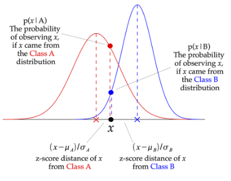
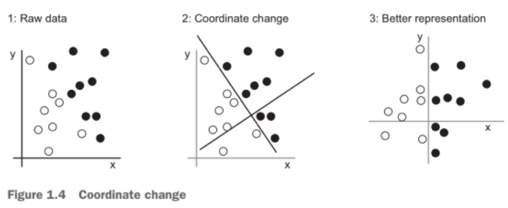

*Given an observation, determine one class from a set of classes that best explains the observation*

***Features are discrete or continuous***

- 2 category classifier
	- Dichotomiser

# Argmax
Argument that gives the maximum value from a target function

# Gaussian Classifier
[Training](Supervised/Supervised.md)
- Each class $i$ has it's own Gaussian $N_i=N(m_i,v_i)$

$$\hat i=\text{argmax}_i\left(p(o_t|N_i)\cdot P(N_i)\right)$$
$$\hat i=\text{argmax}_i\left(p(o_t|N_i)\right)$$
- With equal priors

# Discrete Classifier
- Each class $i$ has it's own histogram $H_i$
	- Describes the probability of each observation type $k$
	- $P(o_t=k|H_i)$, based on class-specific type counts

$$\hat i=\text{argmax}_i\left(P(o_t=k|H_i)\right)$$
- Nothing else known about classes

$$\hat i=\text{argmax}_i\left(P(o_t=k|H_i)\cdot P(H_i)\right)$$
- Given class priors $P(H_i)$
- Maximum posterior probability
	- Bayes

