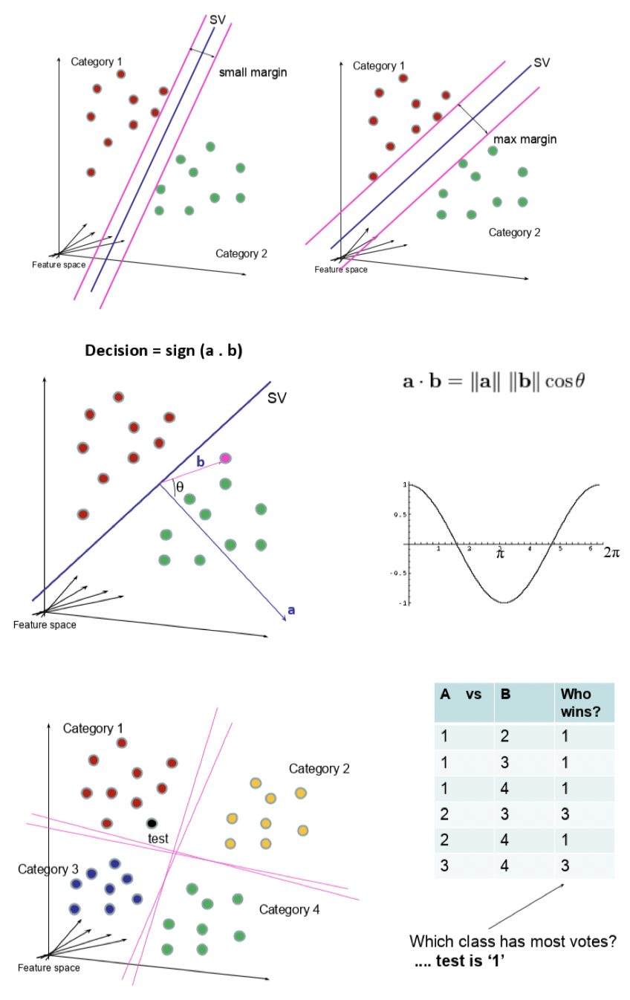
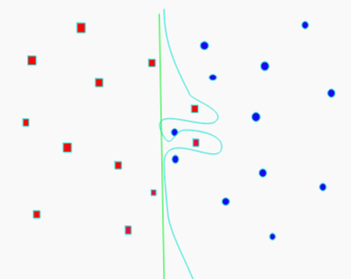
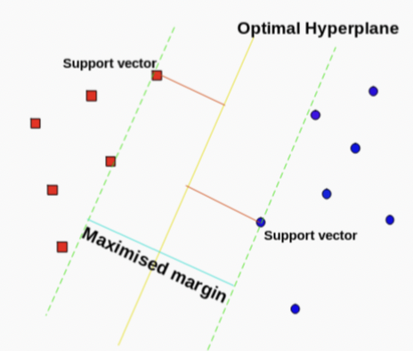
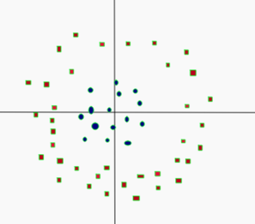
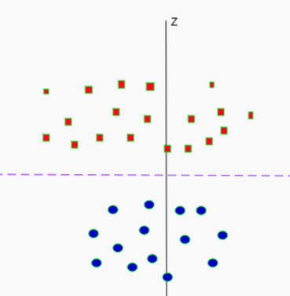
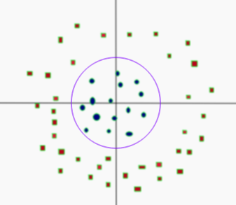

---
tags:
  - ai
---
[Towards Data Science: SVM](https://towardsdatascience.com/support-vector-machines-svm-c9ef22815589)
[Towards Data Science: SVM an overview](https://towardsdatascience.com/https-medium-com-pupalerushikesh-svm-f4b42800e989)

- Dividing line between two classes
	- Optimal hyperplane for a space
	- Margin maximising hyperplane
- Can be used for
	- [Classification](../Classification.md)
		- SVC
	- Regression
		- SVR
- Alternative to Eigenmodels for [supervised](../../Learning.md#Supervised) classification
- For smaller datasets
	- Hard to scale on larger sets

- Support vector points
	- Closest points to the hyperplane
	- Lines to hyperplane are support vectors

- Maximise margin between classes
- Take dot product of test point with vector perpendicular to support vector
- Sign determines class

# Pros
- Linear or non-linear discrimination
- Effective in higher dimensions
- Effective when number of features higher than training examples
- Best for when classes are separable
- Outliers have less impact

# Cons
- Long time for larger datasets
- Doesn’t do well when overlapping
- Selecting appropriate kernel

# Parameters
- C
	- How smooth the decision boundary is
	- Larger C makes more curvy
	- 
- Gamma
	- Controls area of influence for data points
	- High gamma reduces influence of faraway points

# Hyperplane

$$\beta_0+\beta_1X_1+\beta_2X_2+\cdot\cdot\cdot+\beta_pX_p=0$$
- $p$-dimensional space
- If $X$ satisfies equation
	- On plane
- Maximal margin hyperplane
- Perpendicular distance from each observation to given plane
	- Best plane has highest distance
- If support vector points shift
	- Plane shifts
	- Hyperplane only depends on the support vectors
		- Rest don't matter

# Linearly Separable
- Not linearly separable

- Add another dimension
	- $z=x^2+y^2$
- Square of the distance of the point from the origin

- Now separable
- Let $z=k$
	- $k$ is a constant
- Project linear separator back to 2D
	- Get circle
