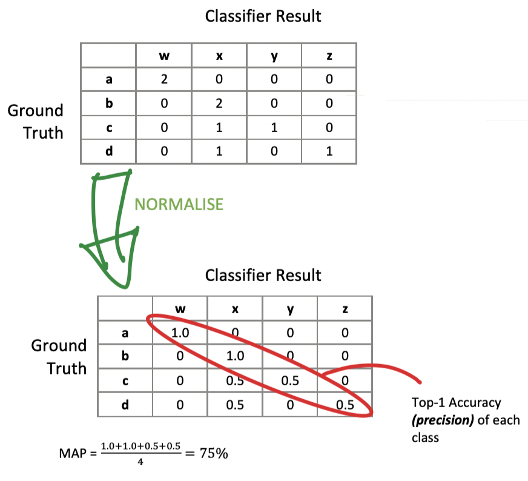
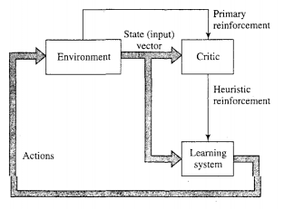
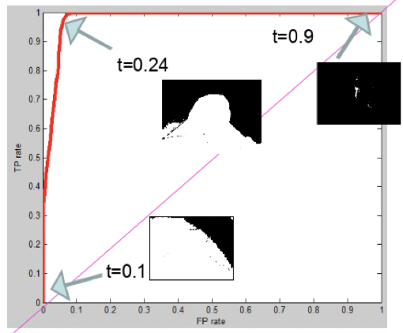

# Supervised
- Dataset with inputs manually annotated for desired output
	- Desired output = supervisory signal
	- Manually annotated = ground truth
		- Annotated correct categories

## Split data
- Training set
- Test set
***Don't test on training data***

## Top-K Accuracy
- Whether correct answer appears in the top-k results

## Confusion Matrix
Samples described by ***feature vector***
Dataset forms a matrix

# Un-Supervised
- No example outputs given, learns how to categorise
- No teacher or critic

## Harder
- Must identify relevant distinguishing features
- Must decide on number of categories

# Reinforcement Learning
- No teacher - critic instead
- Continued interaction with the environment
- Minimise a scalar performance index

- Critic
	- Converts primary reinforcement to heuristic reinforcement
	- Both scalar inputs
- Delayed reinforcement
	- System observes temporal sequence of stimuli
	- Results in generation of heuristic reinforcement signal
- Minimise cost-to-go function
	- Expectation of cumulative cost of actions taken over sequence of steps
	- Instead of just immediate cost
	- Earlier actions may have been good
		- Identify and feedback to environment
- Closely related to dynamic programming

## Difficulties
- No teacher to provide desired response
- Must solve temporal credit assignment problem
	- Need to know which actions were the good ones

# Fitting
- Over-fitting
	- Classifier too specific to training set
	- Can't adequately generalise
- Under-fitting
	- Too general, not inferred enough detail
	- Learns non-discriminative or non-desired pattern

# ROC
Receiver Operator Characteristic Curve
