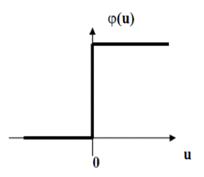
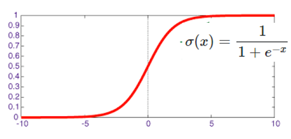
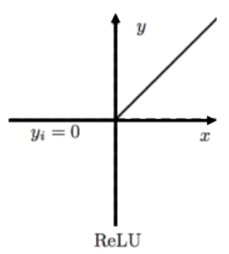

- Limits output values
- Squashing function

# Threshold
- For binary functions
- Not differentiable
	- Sharp rise
- *Heaviside function*
- Unipolar
	- 0 <-> +1
- Bipolar
	- -1 <-> +1

# Sigmoid
-   Logistic function
-   Normalises
-   Introduces non-linearity
-   Alternative is $tanh$
	- -1 <-> +1
-   Easy to take derivative
$$\frac d {dx} \sigma(x)=
\frac d {dx} \left[ 
\frac 1 {1+e^{-x}}
\right]
=\sigma(x)\cdot(1-\sigma(x))$$

### Derivative

$$y_j(n)=\varphi_j(v_j(n))=
\frac 1 {1+e^{-v_j(n)}}$$
$$\frac{\partial y_j(n)}{\partial v_j(n)}=
\varphi_j'(v_j(n))=
\frac{e^{-v_j(n)}}{(1+e^{-v_j(n)})^2}=
y_j(n)(1-y_j(n))$$
- Nice derivative
- Max value of $\varphi_j'(v_j(n))$ occurs when $y_j(n)=0.5$
- Min value of 0 when $y_j=0$ or $1$
- Initial [weights](Weight%20Init.md) chosen so not saturated at 0 or 1

If $y=\frac u v$
Where $u$ and $v$ are differential functions

$$\frac{dy}{dx}=\frac d {dx}\left(\frac u v\right)$$

$$\frac{dy}{dx}=
\frac {v \frac d {dx}(u) - u\frac d {dx}(v)} {v^2}$$

# ReLu
Rectilinear
- For deep networks
- $y=max(0,x)$
- CNNs
	- Breaks associativity of successive [convolutions](../../Signal%20Proc/Convolution.md)
		- Critical for learning complex functions
	- Sometimes small scalar for negative
		- Leaky ReLu

# SoftMax
- Output is per-class vector of likelihoods #ai/classification 
	- Should be normalised into probability vector

## AlexNet
$$f(x_i)=\frac{\text{exp}(x_i)}{\sum_{j=1}^{1000}\text{exp}(x_j)}$$