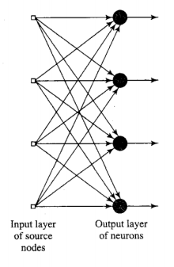
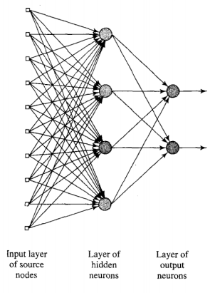
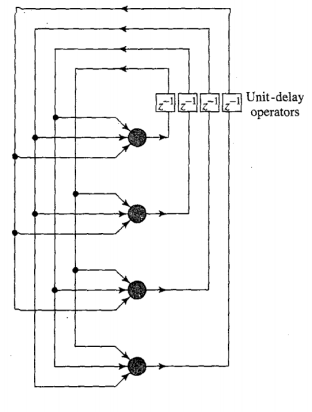
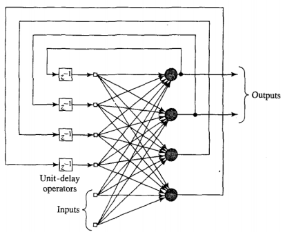

# Single-Layer Feedforward
- *Acyclic*
- Count output layer, no computation at input

# Multilayer Feedforward
- Hidden layers
	- Extract higher-order statistics
	- Global perspective
	- Helpful with large input layer
- Fully connected
	- Every neuron is connected to every neuron adjacent layers
- Below is a 10-4-2 network

# Recurrent
- At least one feedback loop
- Below has no self-feedback

- Above has hidden neurons