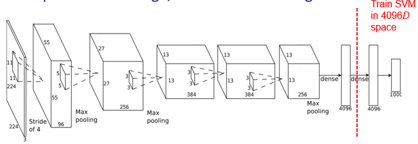
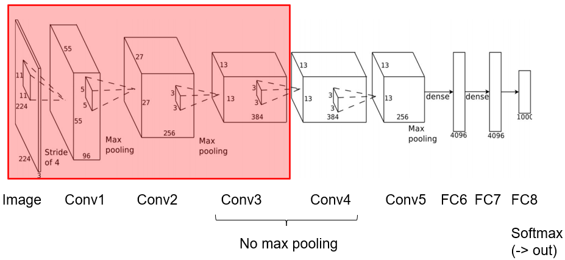
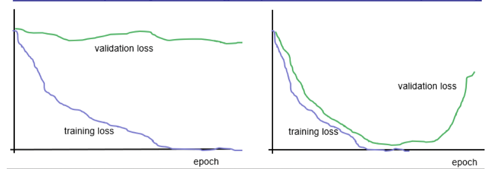

---
tags:
  - ai
---
## Before 2010s
- Data hungry
	- Need lots of training data
- Processing power
- Niche
	- No-one cared/knew about CNNs
## After
- [ImageNet](../CV/Datasets.md#ImageNet)
	- 16m images, 1000 classes
- GPUs
	- General processing GPUs
	- CUDA
- NIPS/ECCV 2012
	- Double digit % gain on [ImageNet](../CV/Datasets.md#ImageNet) accuracy

# Full Connected
[Dense](../MLP/MLP.md)
- Move from [convolutional](Convolutional%20Layer.md) operations towards vector output
- Stochastic drop-out
	- Sub-sample channels and only connect some to [dense](../MLP/MLP.md) layers

# As a Descriptor
- Most powerful as a deeply learned feature extractor
- [Dense](../MLP/MLP.md) classifier at the end isn't fantastic
	- Use SVM to classify prior to penultimate layer

# Finetuning
- Observations
	- Most CNNs have similar weights in [conv1](Convolutional%20Layer.md)
	- Most useful CNNs have several [conv layers](Convolutional%20Layer.md)
		- Many weights
		- Lots of training data
	- Training data is hard to get
		- Labelling
- Reuse weights from other network
- Freeze weights in first 3-5 [conv layers](Convolutional%20Layer.md)
	- Learning rate = 0
	- Randomly initialise remaining layers
	- Continue with existing weights

# Training
- Validation & training [loss](../Deep%20Learning.md#Loss%20Function)
- Early
	- Under-fitting
	- Training not representative
- Later
	- Overfitting
- V.[loss](../Deep%20Learning.md#Loss%20Function) can help adjust learning rate
	- Or indicate when to stop training

