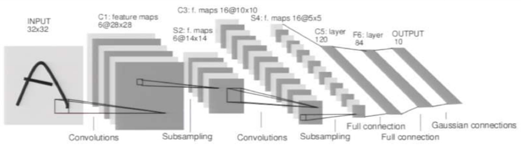
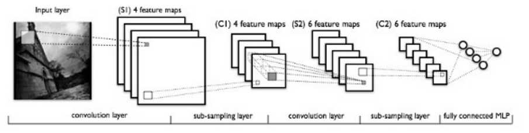
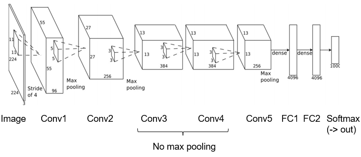
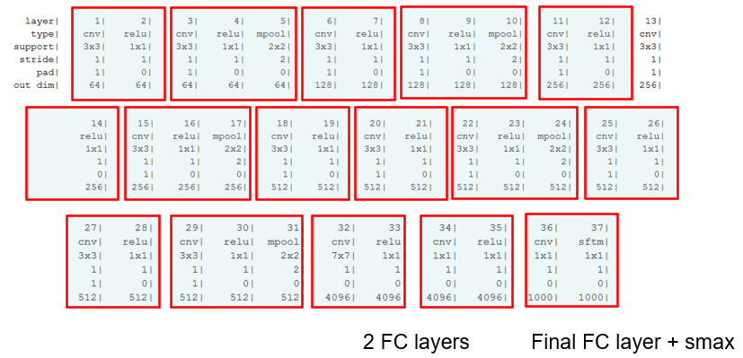
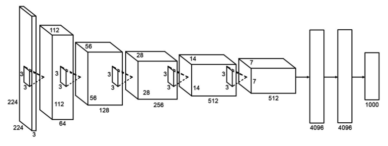
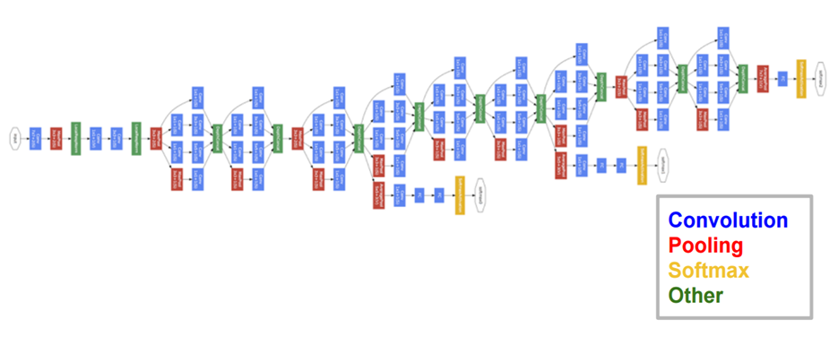
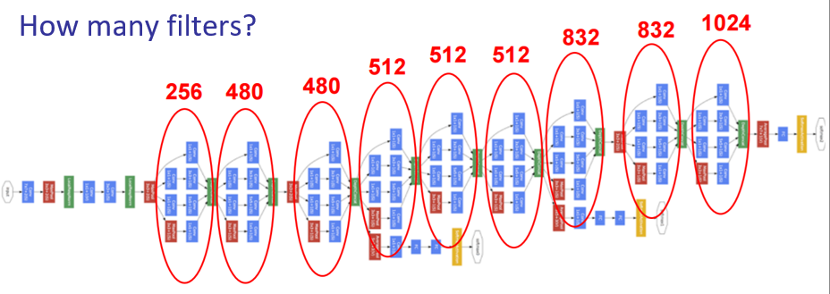
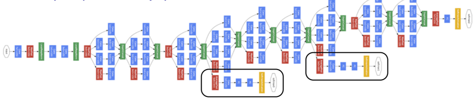

# LeNet
- 1990's

- 1989

- 1998

# AlexNet
2012

- [[Activation Functions#ReLu|ReLu]]
- Normalisation

# VGG
2015

- 16 layers over AlexNet's 8
- Looking at vanishing gradient problem
	- Xavier
- Similar kernel size throughout
- Gradual filter increase

# GoogLeNet
2015

- [Inception Layer](Inception%20Layer.md)s
- Multiple [[Deep Learning#Loss Function|Loss]] Functions

## [Inception Layer](Inception%20Layer.md)

## Auxiliary [[Deep Learning#Loss Function|Loss]] Functions
- Two other SoftMax blocks
- Help train really deep network
	- Vanishing gradient problem

