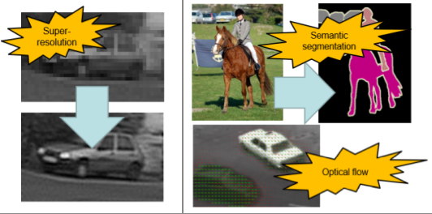
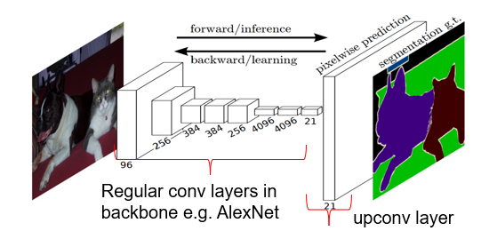
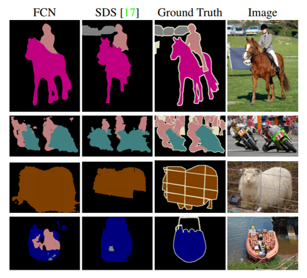

Fully [Convolution](../../../../Signal%20Proc/Convolution.md)al Network

[Convolutional](../Convolutional%20Layer.md) and [up-convolutional layers](../UpConv.md) with [ReLu](../../Activation%20Functions.md#ReLu) but no others (pooling)
- All some sort of Encoder-Decoder

Contractive → [UpConv](../UpConv.md)

# Image Segmentation
- For visual output
	- Previously image $\rightarrow$ vector
- Additional layers to up-sample representation to an image
	- Up-[convolution](../../../../Signal%20Proc/Convolution.md)al
	- De-[convolution](../../../../Signal%20Proc/Convolution.md)al

# Training
- Rarely from scratch
- Pre-trained weights
- Replace final layers
	- [FC](../../MLP/MLP.md) layers
	- White-noise initialised
- Add [UpConv](../UpConv.md) layer(s)
	- Fine-tune train
	- Freeze others
	- Annotated GT images
- Can use summed per-pixel log [loss](../../Deep%20Learning.md#Loss%20Function)

# Evaluation

- SDS
	- Classical method
	- 52% mAP
- FCN
	- 62% mAP
- Intersection over Union
	- IOU
	- Jaccard
	- Averaged over all images
	- $J(A,B)=\frac{|A\cap B|}{|A\cup B|}$