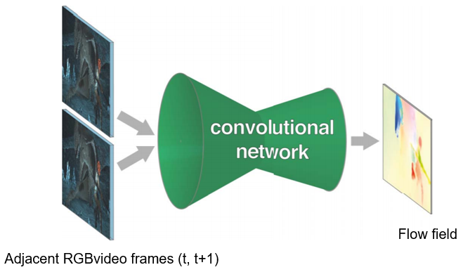
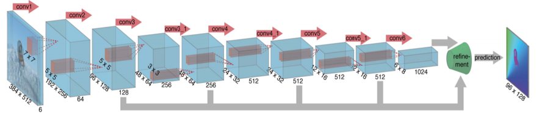
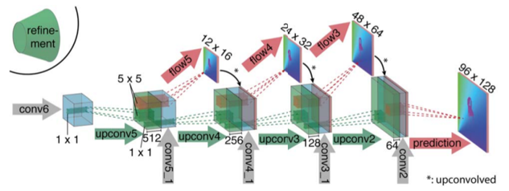
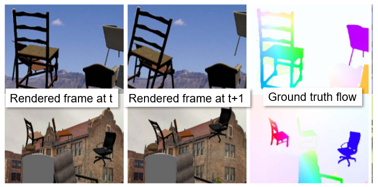

Optical Flow

- 2-Channel optical flow
	- $dx,dy$
- Two consecutive frames
	- 6-channel [tensor](../../../../Maths/Tensor.md)

# [[Skip Connections]]
- Further through the network information is condensed
	- Less high frequency information
- Link encoder layers to [[upconv]] layers
	- Append activation maps from encoder to decoder

# Encode

# [[Upconv]]

# Training
- Synthetic rendered objects
- Real background images

