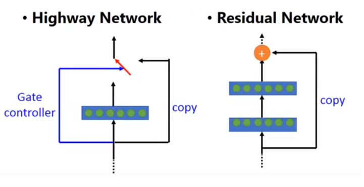

- [Skip Connections](Skip%20Connections.md) across individual layers
	- Conditionally
- Soft gates
	- Learn vs carry
- Gradients propagate further
- Inspired by [LSTM](../../RNN/LSTM.md) [RNN](../../RNN/RNN.md)s

