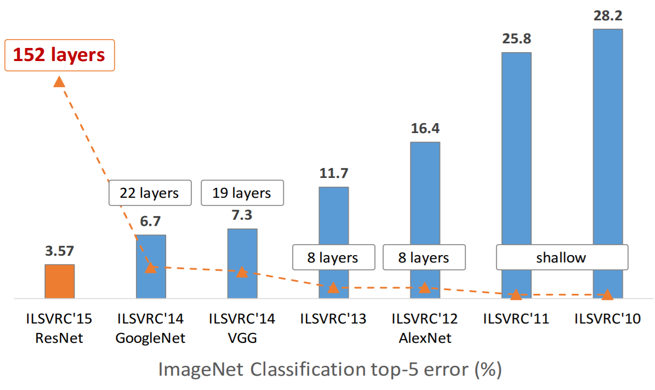
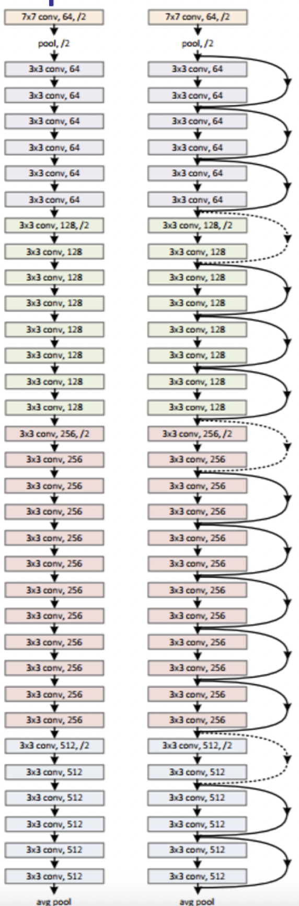
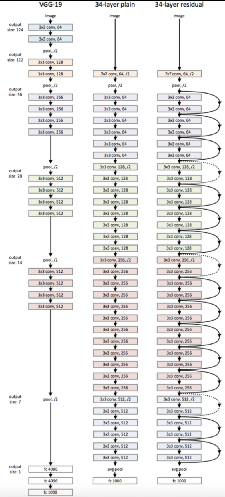

- Residual networks
- 152 layers
- Skips every two layers
	- Residual block
- Later layers learning the identity function
	- Skips help
	- Deep network should be at least as good as shallower one by allowing some layers to do very little
- Vanishing gradient
	- Allows shortcut paths for gradients
- Accuracy saturation
	- Adding more layers to suitably deep network increases training error

# Design

- Skips across pairs of [conv layers](../Convolutional%20Layer.md)
	- Elementwise addition
- All layer 3x3 kernel
- Spatial size halves each layer
- Filters doubles each layer
- [Fully convolutional](FCN.md)
	- No fc layer
	- No [pooling](../Max%20Pooling.md)
		- Except at end
	- No dropout

[ImageNet](../../CV/Datasets.md#ImageNet) Error:

