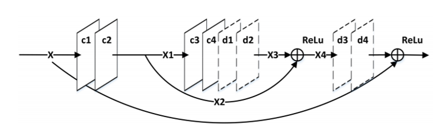

---
tags:
  - ai
---
- Output of [conv](../Convolutional%20Layer.md), c, layers are added to inputs of [UpConv](../UpConv.md), d, layers
- Element-wise, not channel appending
- Propagate high frequency information to later layers
- Two types
	- Additive
		- [ResNet](ResNet.md)
		- [Super-Resolution](Super-Resolution.md) auto-encoder
- Concatenative
	- Densely connected architectures
	- DenseNet
	- [FlowNet](FlowNet.md)

[AI Summer - Skip Connections](https://theaisummer.com/skip-connections/)
[Arxiv - Visualising the Loss Landscape](https://arxiv.org/abs/1712.09913)