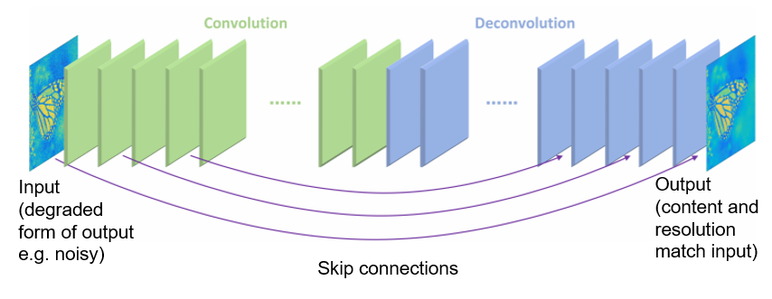
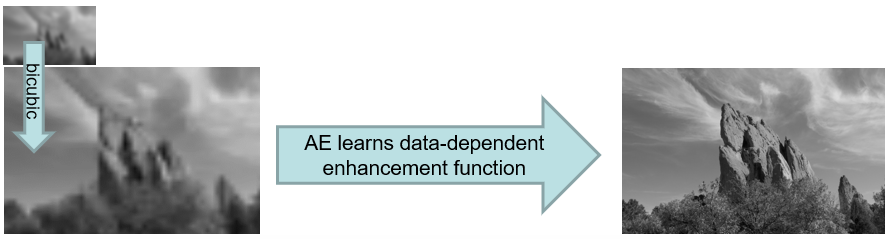

- Auto-encoders
	- Get same image back
- Up-sample blurry small image classically
	- Bi-cubic
	- Encode-decode to deep sharpen
- No ground truth
	- [Unsupervised](../../../Learning.md#Un-Supervised)?
- Decoder stage
	- Identical architecture to encoder

- Is actually contractive/up sampling
