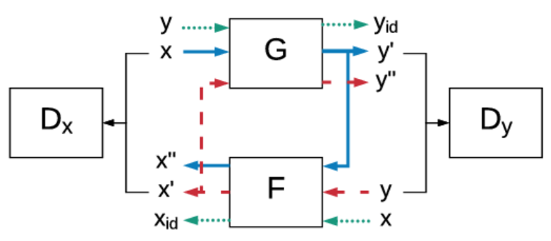
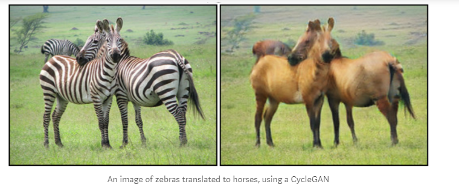

Cycle Consistent [GAN](GAN.md)

- G
	- $x \rightarrow y$
- F
	- $y \rightarrow x$
- Aims to bridge gap across domains
	- Zebras-horses
	- Audi-BMW
- Learn bidirectional mapping function
- Transitivity regularises training
- $x \rightarrow y'$
	- $y' \rightarrow x''$
		- $x == x''$
		- Cycle consistency
- Requires two datasets
	- One for each domain
	- Not directly paired
		- Unlike edge map $\rightarrow$ bag

