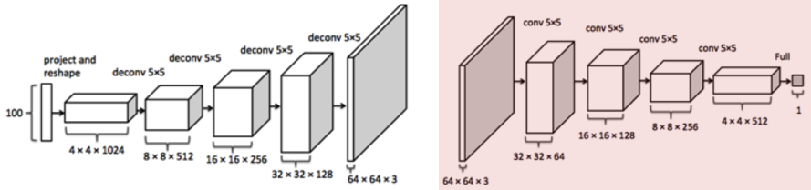

---
tags:
  - ai
  - media
  - art
---
Deep [Convolutional](../../../../Signal%20Proc/Convolution.md) [GAN](GAN.md)

- Generator
	- [FCN](../FCN/FCN.md)
	- Decoder
	- Generate image from code
		- Low-dimensional
			- ~100-D
	- Reshape to [tensor](../../../../Maths/Tensor.md)
		- [UpConv](../UpConv.md) to image
	- Train using Gaussian random noise for code
- Discriminator
	- Contractive
	- Cross-entropy [loss](../../Deep%20Learning.md#Loss%20Function)
	- [Conv](../Convolutional%20Layer.md) and leaky [ReLu](../../Activation%20Functions.md#ReLu) layers only
	- Normalised output via [sigmoid](../../Activation%20Functions.md#Sigmoid)

## [Loss](../../Deep%20Learning.md#Loss%20Function)
$$D(S,L)=-\sum_iL_ilog(S_i)$$
- $S$
	- $(0.1, 0.9)^T$
	- Score generated by discriminator
- $L$
	- $(1, 0)^T$
	- One-hot label vector
	- Step 1
		- Depends on choice of real/fake
	- Step 2
		- One-hot fake vector
- $\sum_i$
	- Sum over all images in mini-batch

| Noise | Image |
| ----- | ----- |
| $z$   | $x$   | 

- Generator wants
	- $D(G(z))=1$
	- Wants to fool discriminator
- Discriminator wants
	- $D(G(z))=0$
	- Wants to correctly catch generator
- Real data wants
	- $D(x)=1$

$$J^{(D)}=-\frac 1 2 \mathbb E_{x\sim p_{data}}\log D(x)-\frac 1 2 \mathbb E_z\log (1-D(G(z)))$$
$$J^{(G)}=-J^{(D)}$$
- First term for real images
- Second term for fake images

# Mode Collapse
- Generator gives easy solution
- Learns one image for most noise that will fool discriminator
- Mitigate by minibatch discriminator
	- Match G(z) distribution to x

# What is Learnt?
- Encoding texture/patch detail from training set
	- Similar to [FCN](../FCN/FCN.md)
	- Reproducing texture at high level
	- Cues triggered by code vector
		- Input random noise
- Iteratively improves visual feasibility
	- Different to [FCN](../FCN/FCN.md)
- Discriminator is a task specific classifier #classification 
- Difficult to train over diverse footage
	- Mixing concepts doesn't work
	- Single category/class