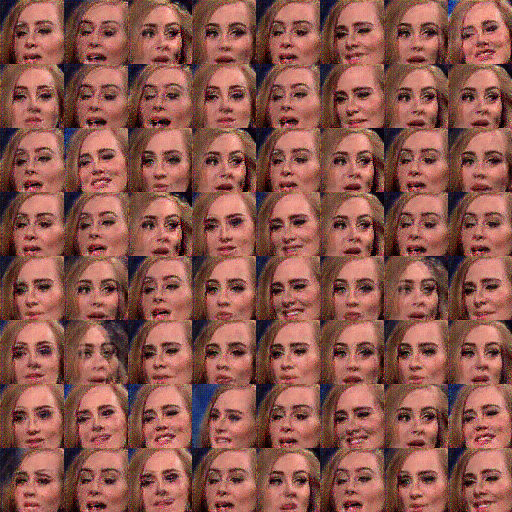
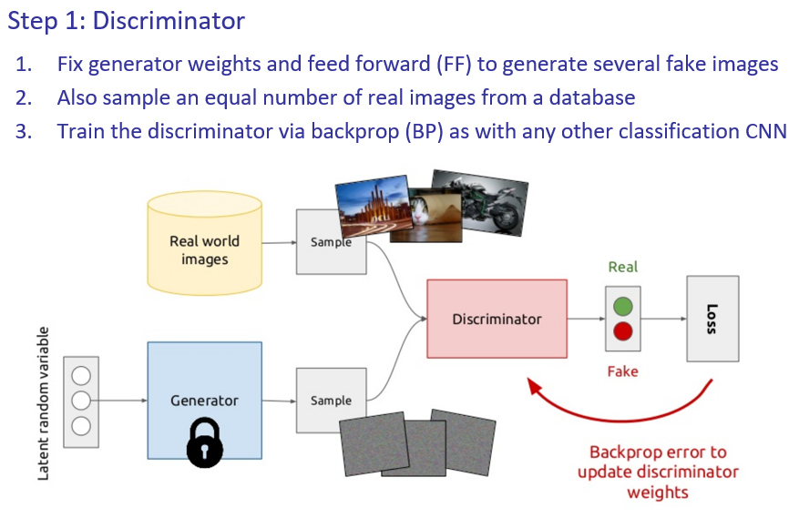
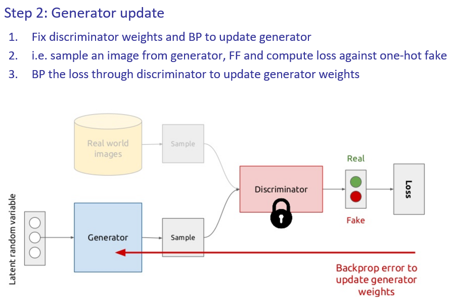
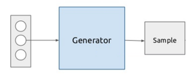
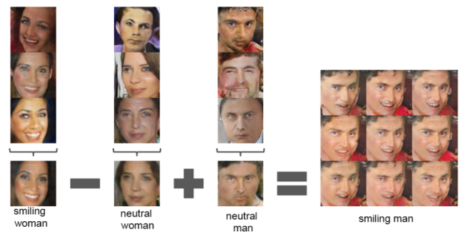

# Fully [Convolution](../../../../Signal%20Proc/Convolution.md)al
- Remove [Max Pooling](../Max%20Pooling.md)
	- Use strided [UpConv](../UpConv.md)
- Remove [FC](../../MLP/MLP.md) layers
	- Hurts convergence in non-[classification](../../../Classification/Classification.md)
- Normalisation tricks
	- Batch normalisation
		- Batches of 0 mean and variance 1
	- Leaky [ReLu](../../Activation%20Functions.md#ReLu)

# Stages
## Generator, G
- Synthesise 'fake' images
- From noise
## Discriminator, D
- Discriminator is a classifier #ai/classification 
	- Is image fake or real

]

# Training

# Code Vector Math for Control

- Do [AM](../Interpretation.md#Activation%20Maximisation) to derive code for an image
