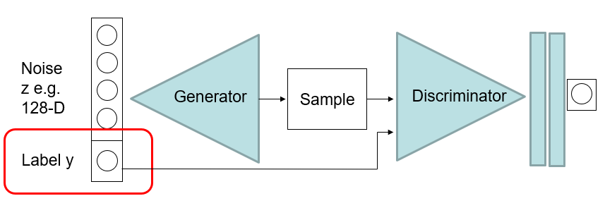
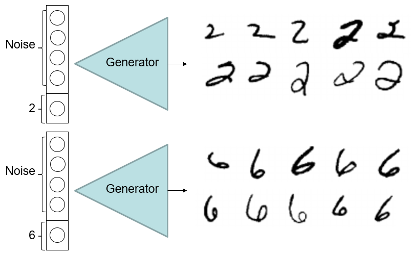
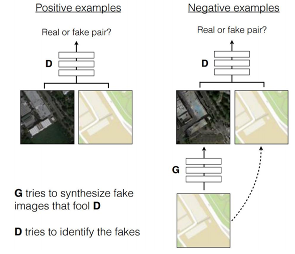
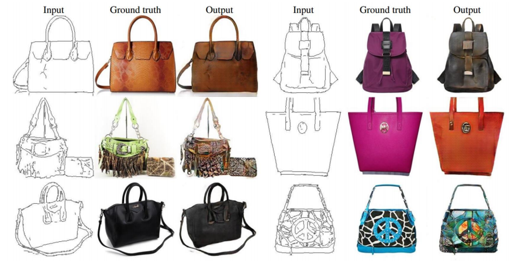
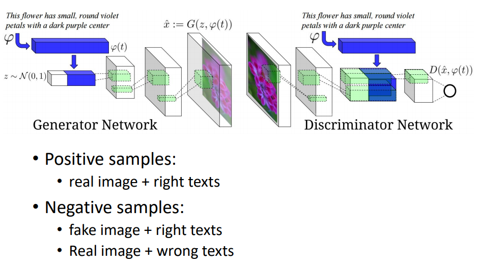

Conditional [GAN](GAN.md)

- Hard to control with [AM](../Interpretation.md#Activation%20Maximisation)
	- Unconditional [GAN](GAN.md)
- Condition synthesis on a class label
- Concatenate unconditional code with conditioning vector
	- Label
- No longer [unsupervised](../../../Learning.md#Un-Supervised)
	- Everything labelled
		- Fake images and dataset
	- **Requires pairing**

# Image Conditioning Vector

# Text Encoding
- word2vec

