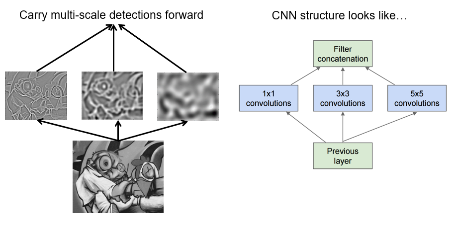
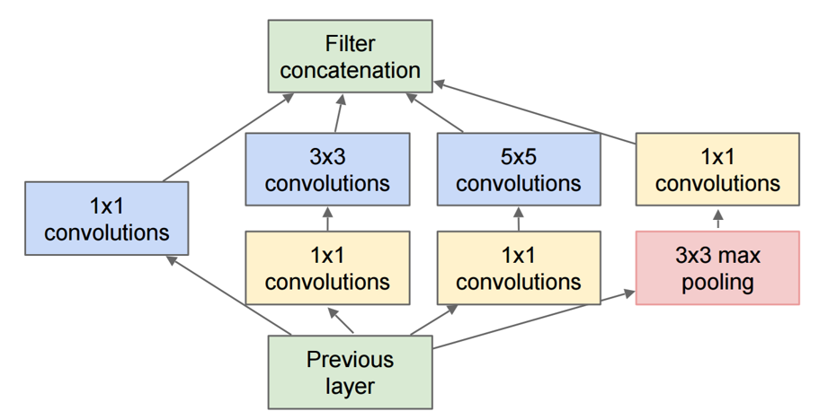

- Similar to band-pass pyramid
- Changes fixed scale window sizes
	- Couple of different scales
	- Concatenate results

- 1 x 1
	- Averages over channels
	- Bottleneck layer
		- Reduces computation
			- x 10
		- Shrinks number of filters