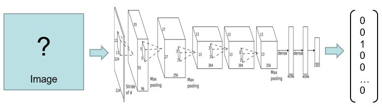
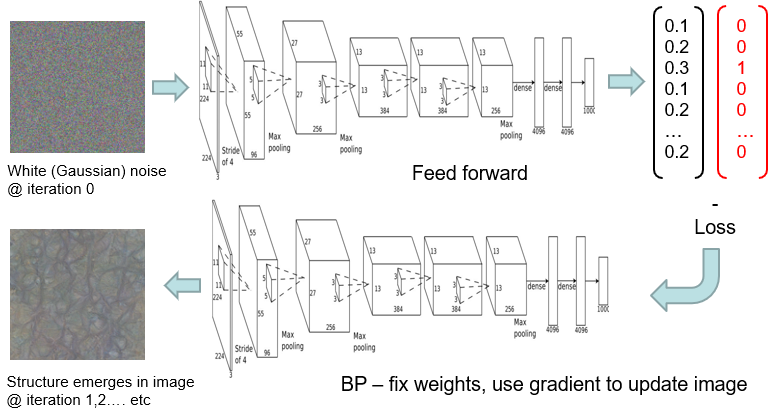
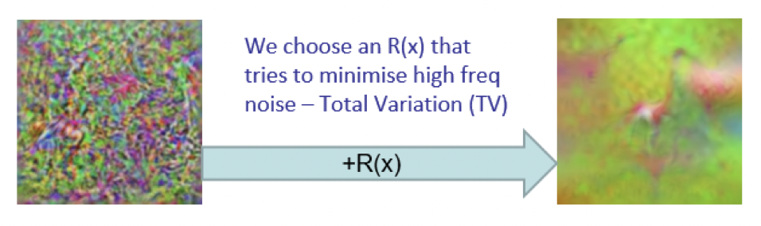

# Activation Maximisation
- Synthesise an ideal image for a class
	- Maximise 1-hot output
	- Maximise [SoftMax](../Activation%20Functions.md#SoftMax)

- **Use trained network**
	- Don't update weights
- [Feedforward](../Architectures.md) noise
	- [Back-propagate](../MLP/Back-Propagation.md) [loss](../Deep%20Learning.md#Loss%20Function)
		- Don't update weights
		- Update image

## Regulariser
- Fit to natural image statistics
- Prone to high frequency noise
	- Minimise
- Total variation
	- $x^*$ is the best solution to minimise [loss](../Deep%20Learning.md#Loss%20Function)

$$x^*=\text{argmin}_{x\in \mathbb R^{H\times W\times C}}\mathcal l(\phi(x),\phi_0)$$
- Won't work
$$x^*=\text{argmin}_{x\in \mathbb R^{H\times W\times C}}\mathcal l(\phi(x),\phi_0)+\lambda\mathcal R(x)$$
- Need a regulariser like above

$$\mathcal R_{V^\beta}(f)=\int_\Omega\left(\left(\frac{\partial f}{\partial u}(u,v)\right)^2+\left(\frac{\partial f}{\partial v}(u,v)\right)^2\right)^{\frac \beta 2}du\space dv$$

$$\mathcal R_{V^\beta}(x)=\sum_{i,j}\left(\left(x_{i,j+1}-x_{ij}\right)^2+\left(x_{i+1,j}-x_{ij}\right)^2\right)^{\frac \beta 2}$$
- Beta
	- Degree of smoothing