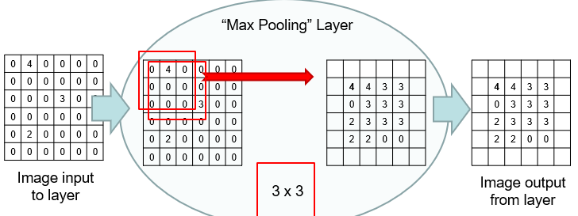

- Maximum within window and writes result to output
	- Downsamples image
	- More non-linearity
- Doesn't remove important information
	- Max value is the good bit
- No parameters

## Design Parameters
- Size of input image
	- 252 x 252 x 1 x n
- Padding
- Kernel size
	- 3 x 3 x 1
	- Doesn't need to be odd
		- 2 x 2
- Stride
	- Typically n
		- For n x n kernel size
	- Sometimes 4 x 4 in early layers
		- 16 times less data
			- Rapid downsample
- Size of computable output
	- 250 x 250 x 1 x n
		- Depends on padding and striding