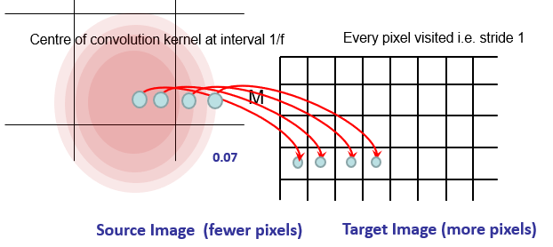
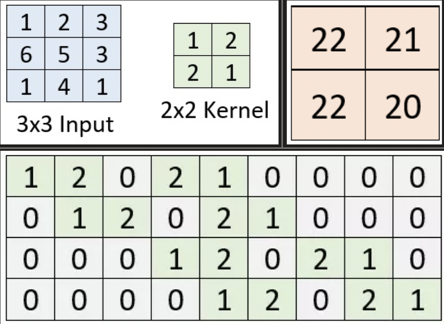
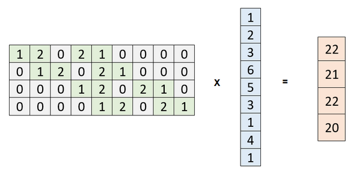
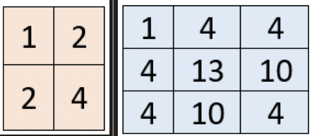
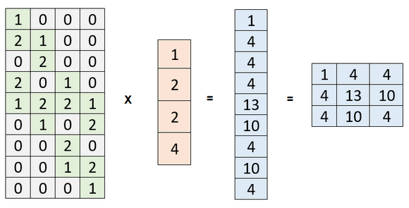

- Fractionally strided convolution
- Transposed [Convolution](../../../Signal%20Proc/Convolution.md)
	- Like a deep interpolation
- Convolution with a fractional input stride
- Up-sampling is convolution 'in reverse'
	- Not an actual inverse convolution
- For scaling up by a factor of $f$
	- Consider as a [Convolution](../../../Signal%20Proc/Convolution.md) of stride $1/f$
- Could specify kernel
	- Or learn
- Can have multiple upconv layers
	- Separated by [ReLu](../Activation%20Functions.md#ReLu)
	- For non-linear up-sampling conv
	- Interpolation is linear

# Convolution Matrix
Normal

- Equivalent operation with a flattened input
	- Row per kernel location
- Many-to-one operation

[Understanding transposed convolutions](https://www.machinecurve.com/index.php/2019/09/29/understanding-transposed-convolutions/)

## Transposed

- One-to-many

