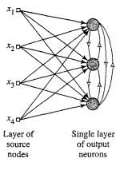
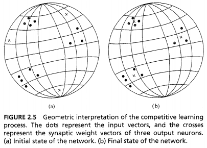

---
tags:
  - ai
---
- Only single output neuron fires

1. Set of homogeneous neurons with some randomly distributed synaptic weights
	- Respond differently to given set of input patterns
2. Limit imposed on strength of each neuron
3. Mechanism to allow neurons to compete for right to respond to a given subset of inputs
	- Only one output neuron active at a time
	- Or only one neuron per group
	- ***Winner-takes-all neuron***

- Lateral inhibition
	- Neurons inhibit other neurons
- Winning neuron must have highest induced local field for given input pattern
	- Winning neuron is squashed to 1
	- Others are clamped to 0

$$y_k=
\begin{cases}
    1 & \text{if } v_k > v_j \text{ for all } j,j\neq k \\
    0 & \text{otherwise}
\end{cases}
$$

- Neuron has fixed amount of weight spread amongst input synapses
	- Sums to 1
- Learn by shifting weights from inactive to active input nodes
	- Each input node relinquishes some proportion of weight
	- Distributed amongst active nodes

$$\Delta w_{kj}=
\begin{cases}
    \eta(x_j-w_{kj}) & \text{if neuron $k$ wins the competition}\\
    0 & \text{if neuron $k$ loses the competition}
\end{cases}$$

- Individual neurons learn to specialise on ensembles of similar patterns
	- Feature detectors
