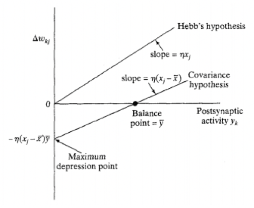

*Time-dependent, highly local, strongly interactive*

- Oldest learning algorithm
- Increases synaptic efficiency as a function of the correlation between presynaptic and postsynaptic activities

1. If two neurons on either side of a synapse are activated simultaneously/synchronously, then the strength of that synapse is selectively increased
2. If two neurons on either side of a synapse are activated asynchronously, then that synapse is selectively weakened or eliminated

- Hebbian synapse
	- Time-dependent
		- Depends on times of pre/post-synaptic signals
	- Local
	- Interactive
		- Depends on both sides of synapse
		- True interaction between pre/post-synaptic signals
			- Cannot make prediction from either one by itself
	- Conjunctional or correlational
		- Based on conjunction of pre/post-synaptic signals
		- Conjunctional synapse
- Modification classifications
	- Hebbian
		- **Increases** strength with **positively** correlated pre/post-synaptic signals
		- **Decreases** strength with **negatively** correlated pre/post-synaptic signals
	- Anti-Hebbian
		- **Decreases** strength with **positively** correlated pre/post-synaptic signals
		- **Increases** strength with **negatively** correlated pre/post-synaptic signals
		- Still Hebbian in nature, not in function
	- Non-Hebbian
		- Doesn't involve above correlations/time dependence etc

# Mathematically
$$\Delta w_{kj}(n)=F\left(y_k(n),x_j(n)\right)$$
- Generally
- All Hebbian

## Hebb's Hypothesis
$$\Delta w_{kj}(n)=\eta y_k(n)x_j(n)$$
- Activity product rule
- Exponential growth until saturation
	- No information stored
	- Selectivity lost

## Covariance Hypothesis
$$\Delta w_{kj}(n)=\eta(x_j-\bar x)(y_k-\bar y)$$
- Characterised by perturbation from of pre/post-synaptic signals from their mean over a given time interval
- Average $x$ and $y$ constitute thresholds
- Intercept at y = y bar
- Similar to learning in the hippocampus

*Allows:*
1. Convergence to non-trivial state
	- When x = x bar or y = y bar
2. Prediction of both synaptic potentiation and synaptic depression