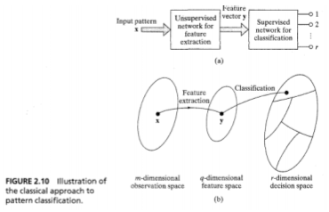
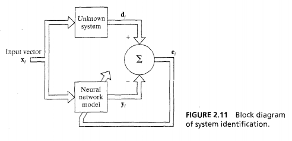
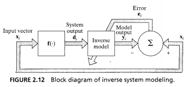

# Pattern Association
- Associative memory
	- Learns by association
- Autoassociation
	- Store a set of patterns by repeatedly presenting them in the network
		- Then presented partial or distorted stored pattern
		- Recall intended
	- Input and output data spaces are same dimensionality
- Heteroassociation
	- Arbitrary set of input patterns paired with another arbitrary set of output patterns
		- Supervised instead of unsupervised
	- No required relationship between input/output dimensionality
- Stages
	- Storage
	- Recall

# Pattern Recognition
- Received pattern/signal is assigned to one of a prescribed number of classes

# Function Approximation
- System Identification

- Inverse System

# Control
- Learn to control a process or critical part of a system

# Filtering
- Filtering
	- Extraction of information about a quantity of interest at discrete time $n$ by using data from time up to $n$
- Smoothing
	- Use information past time $n$
		- Expect smoother result
	- Delay in processing
- Prediction
	- Predict later data using current and previous

# Beamforming
- Spatial filtering
- Distinguish spatial properties of a target signal and background noise
	- Similar to bats
	- Used in radar and sonar