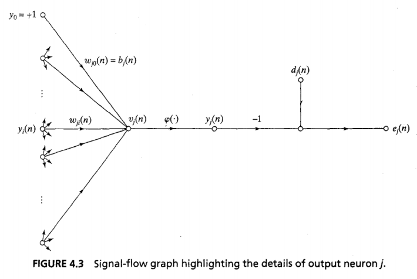
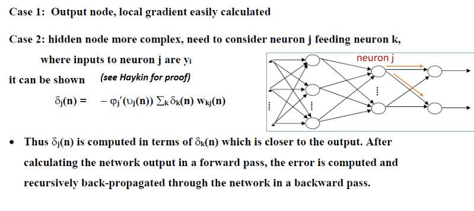
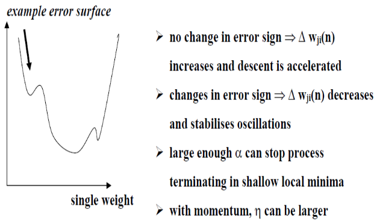
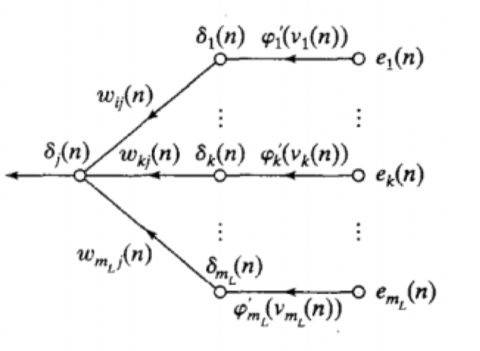
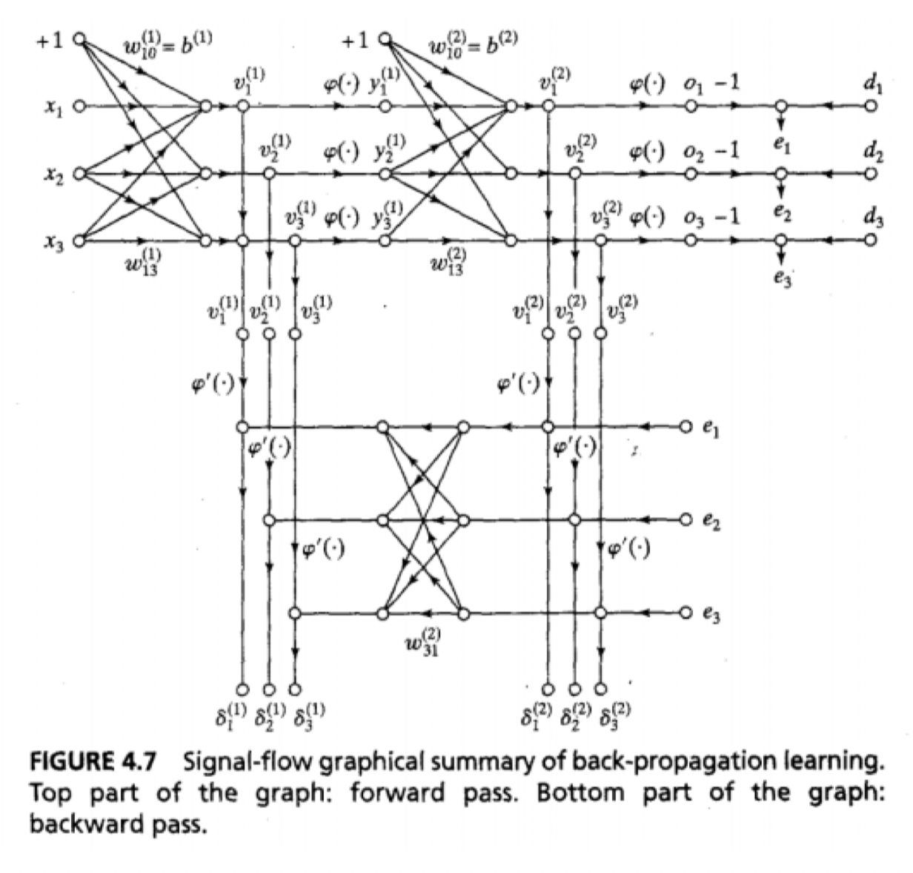
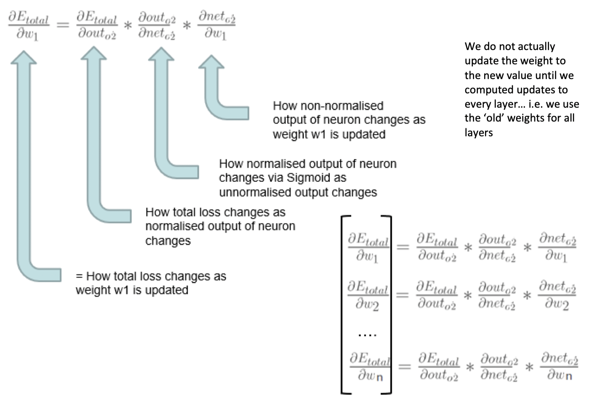
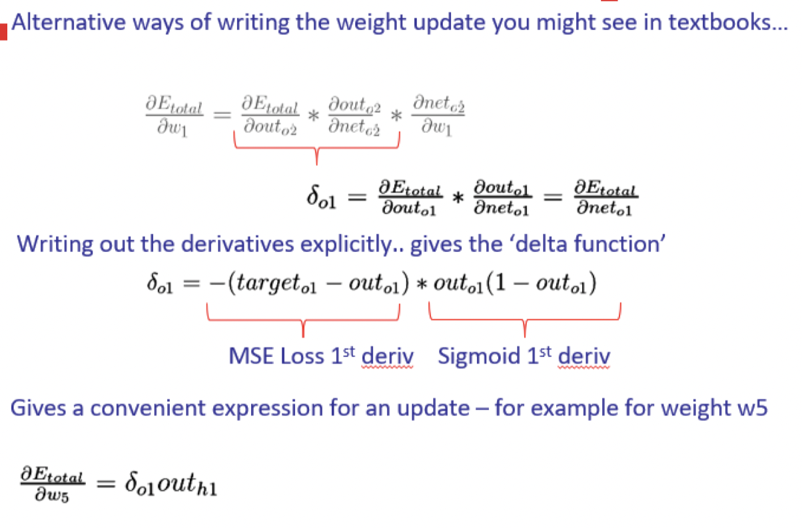

Error signal graph

1. Error Signal
	- $e_j(n)=d_j(n)-y_j(n)$
2. Net Internal Sum
	- $v_j(n)=\sum_{i=0}^mw_{ji}(n)y_i(n)$
3. Output
	- $y_j(n)=\varphi_j(v_j(n))$
4. Instantaneous Sum of Squared Errors
	- $\mathfrak{E}(n)=\frac 1 2 \sum_{j\in C}e_j^2(n)$
	- $C$ = o/p layer nodes
5. Average Squared Error
	- $\mathfrak E_{av}=\frac 1 N\sum_{n=1}^N\mathfrak E (n)$

$$\frac{\partial\mathfrak E(n)}{\partial w_{ji}(n)}=
\frac{\partial\mathfrak E(n)}{\partial e_j(n)}
\frac{\partial e_j(n)}{\partial y_j(n)}
\frac{\partial y_j(n)}{\partial v_j(n)}
\frac{\partial v_j(n)}{\partial w_{ji}(n)}
$$

#### From 4
$$\frac{\partial\mathfrak E(n)}{\partial e_j(n)}=e_j(n)$$

#### From 1
$$\frac{\partial e_j(n)}{\partial y_j(n)}=-1$$
#### From 3 (note prime)
$$\frac{\partial y_j(n)}{\partial v_j(n)}=\varphi_j'(v_j(n))$$
#### From 2
$$\frac{\partial v_j(n)}{\partial w_{ji}(n)}=y_i(n)$$

## Composite
$$\frac{\partial\mathfrak E(n)}{\partial w_{ji}(n)}=
-e_j(n)\cdot
\varphi_j'(v_j(n))\cdot
y_i(n)
$$

$$\Delta w_{ji}(n)=-\eta\frac{\partial\mathfrak E(n)}{\partial w_{ji}(n)}$$
$$\Delta w_{ji}(n)=\eta\delta_j(n)y_i(n)$$

## Gradients
#### Output Local
$$\delta_j(n)=-\frac{\partial\mathfrak E (n)}{\partial v_j(n)}$$
$$=-
\frac{\partial\mathfrak E(n)}{\partial e_j(n)}
\frac{\partial e_j(n)}{\partial y_j(n)}
\frac{\partial y_j(n)}{\partial v_j(n)}$$
$$=
e_j(n)\cdot
\varphi_j'(v_j(n))
$$

#### Hidden Local
$$\delta_j(n)=-
\frac{\partial\mathfrak E (n)}{\partial y_j(n)}
\frac{\partial y_j(n)}{\partial v_j(n)}$$
$$=-
\frac{\partial\mathfrak E (n)}{\partial y_j(n)}
\cdot
\varphi_j'(v_j(n))$$
$$\delta_j(n)=
\varphi_j'(v_j(n))
\cdot
\sum_k \delta_k(n)\cdot w_{kj}(n)$$

## Weight Correction
$$\text{weight correction = learning rate $\cdot$ local gradient $\cdot$ input signal of neuron $j$}$$
$$\Delta w_{ji}(n)=\eta\cdot\delta_j(n)\cdot y_i(n)$$

-   Looking for partial derivative of error with respect to each weight
-   4 partial derivatives
	1.  Sum of squared errors WRT error in one output node
	2.  Error WRT output $y$
	3.  Output $y$ WRT Pre-activation function sum
	4.  Pre-activation function sum WRT weight
		-   Other [weights](../Weight%20Init.md) constant, goes to zero
		-   Leaves just $y_i$
	-   Collect 3 boxed terms as delta $j$
		-   Local gradient
-   Weight correction can be too slow raw
	-   Gets stuck
	-   Add momentum

-   Nodes further back
	-   More complicated
	-   Sum of later local gradients multiplied by backward weight (orange)
	-   Multiplied by differential of activation function at node

## Global Minimum
-   Much more complex error surface than least-means-squared
-   No guarantees of convergence
	-   Non-linear optimisation
-   Momentum
	- $+\alpha\Delta w_{ji}(n-1), 0\leq|\alpha|<1$
	-   Proportional to the change in weights last iteration
		-   Can shoot past local minima if descending quickly

$w^+_5=w_5-\eta\cdot\frac{\partial E_{total}}{\partial w_5}$

