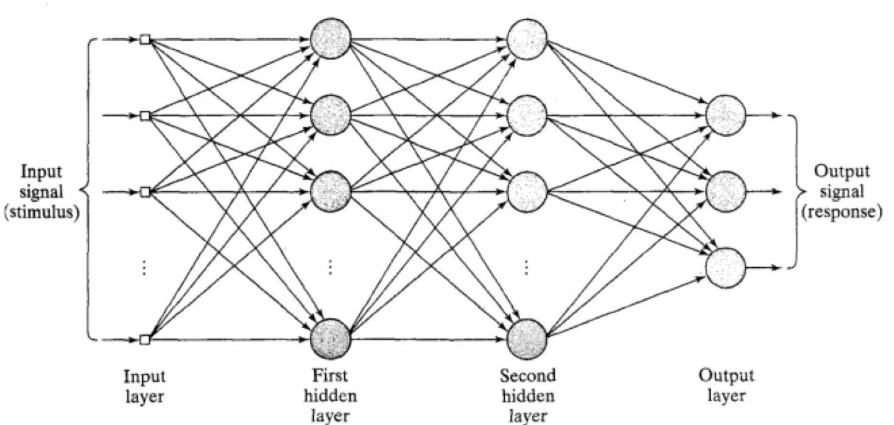
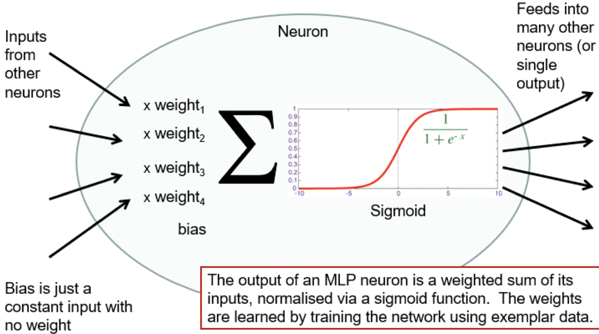
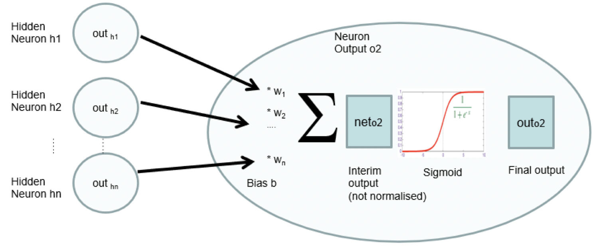
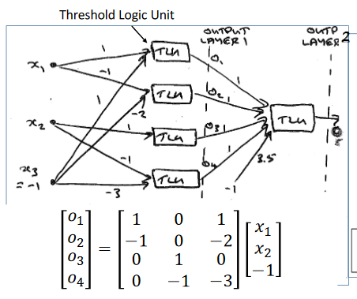
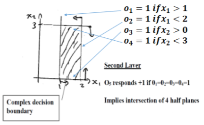

-   [[Architectures|Feedforward]]
-   Single hidden layer can learn any function
	-   Universal approximation theorem
-   Each hidden layer can operate as a different feature extraction layer
-   Lots of [[Weight Init|weights]] to learn
-   [Back-Propagation](Back-Propagation.md) is supervised

# Universal Approximation Theory
A finite [[Architectures|feedforward]] MLP with 1 hidden layer can in theory approximate any mathematical function
-   In practice not trainable with [[Back-Propagation|BP]]

## Weight Matrix
-   Use matrix multiplication for layer output
-   TLU is hard limiter

- $o_1$ to $o_4$ must all be one to overcome -3.5 bias and force output to 1

- Can generate a non-linear [[Decision Boundary|decision boundary]]