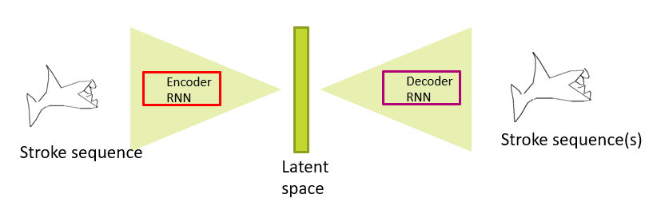
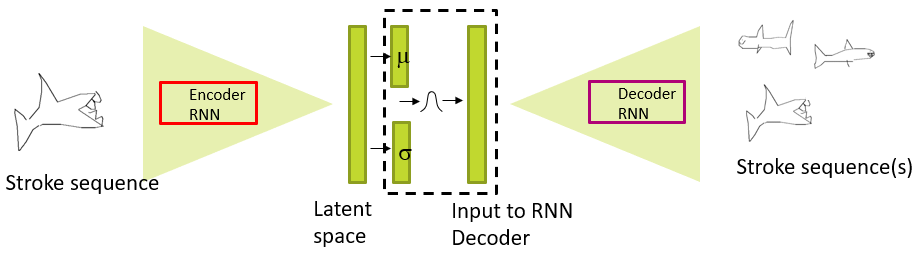

---
tags:
  - ai
  - media
---
- Sequence of strokes for sketching
	- [LSTM](LSTM.md) backbone

# Variational
- Learn mean and covariance to drive encoder stage
	- Generate different outputs by sampling latent space

