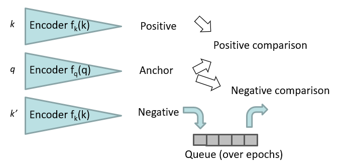

---
tags:
  - ai
---
- Similar to SimCLR
- Rich set of negatives
	- Sampled from previous epochs in queue
- Two function for pos/neg and anchor
	- Pos/neg are delayed anchor weights
		- Updated with momentum
- Two delay mechanisms
	- Two encoder functions
	- Negative encoder queue

$$\theta_k\leftarrow m\theta_k+(1-m)\theta_q$$