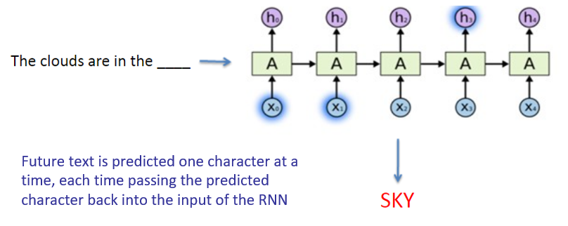
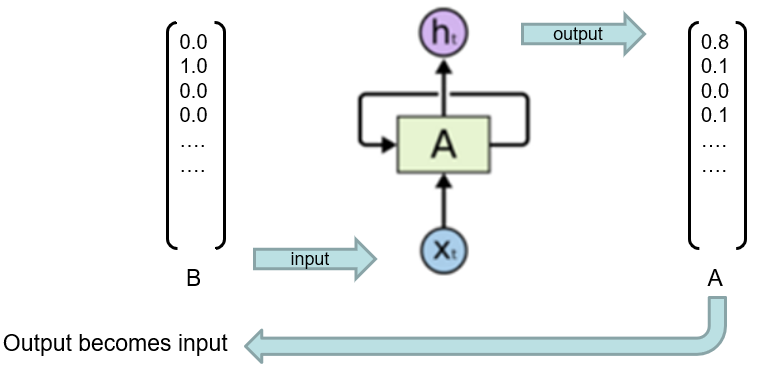

---
tags:
  - ai
---
Recurrent Neural Network

- Hard to train on long sequences
	- Weights hold memory
		- Implicit
	- Lots to remember

## Text Analysis
- Train sequences of text character-by-character
	- Maintains state vector representing data up to current token
	- Combines state vector with next token to create new vector
	- In theory, info from one token can propagate arbitrarily far down the sequence
		- In practice suffers from vanishing gradient
			- Can't extract precise information about previous tokens

