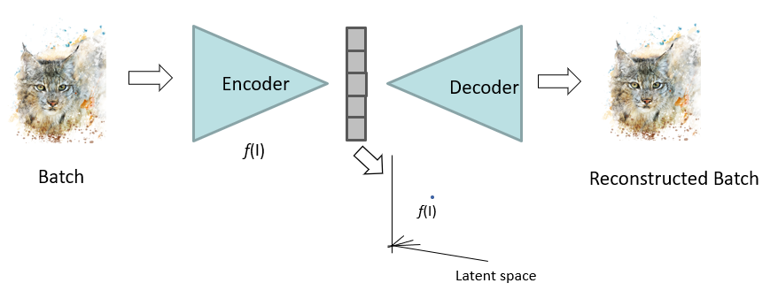
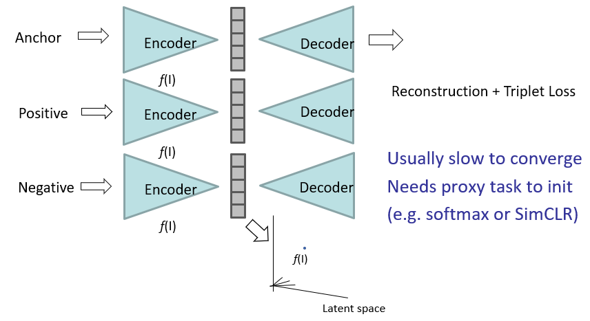

---
tags:
  - ai
  - media
---
# [Un-Supervised](../../Learning.md#Un-Supervised)

- Auto-encoder FCN
- Learns bottleneck (latent) representation
	- Information rich
	- $f(.)$ is CNN encoding function

# [Supervised](../../Learning.md#Supervised)
- Triplet loss
	- Providing positive and negative requires supervision
- Two losses
