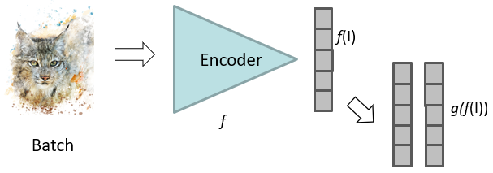

---
tags:
  - ai
  - media
---
1. Data augmentation
	- Crop patches from images in batch
	- Add colour jitter
2. Within batch sample positive and negative
	- Patches from same image are positive
	- All other negative
3. [MLP](../MLP/MLP.md) layer to compute loss instead of bottleneck embedding
	- Head network for function of bottleneck

