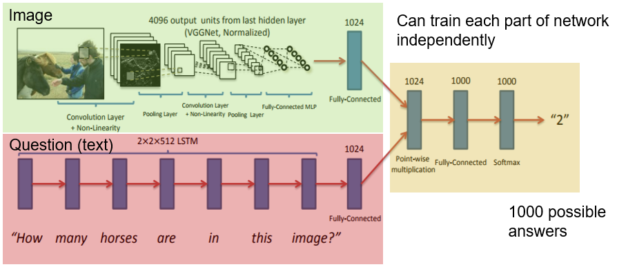
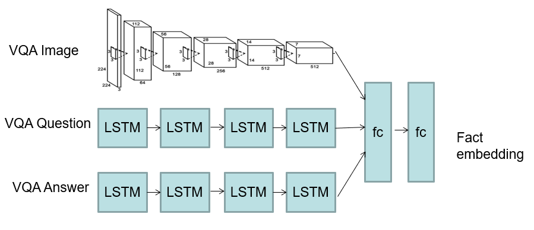

---
tags:
  - ai
  - ai/media
---
Visual Question Answering

- Combine visual with text sequence
	- [CNN](../CNN/CNN.md) + [LSTM](LSTM.md)
	- Generate text from images
		- Automatic scene description
	- Cross-modal

- Word embedding not character

# Freeform
- Encode facts with two text streams

# Limitations
- Repetitive answers
	- Not much variation
- No creativity
	- Wont generalise beyond taught concepts