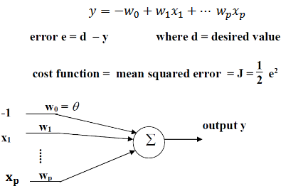
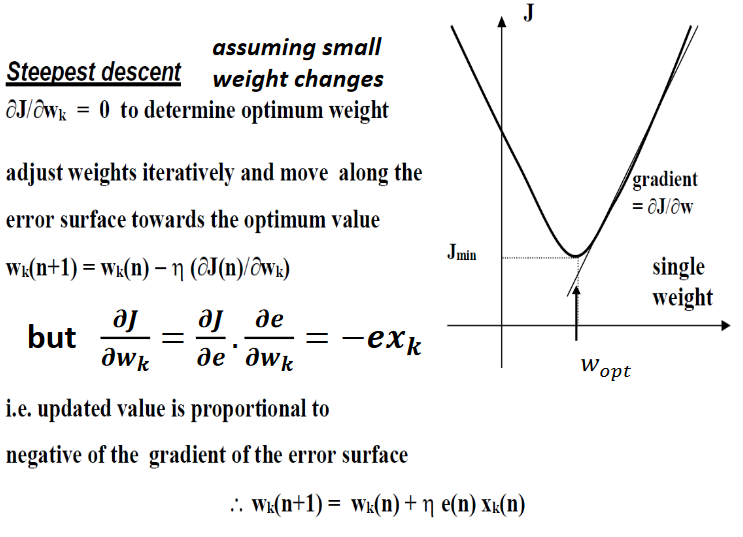
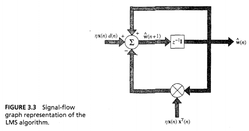
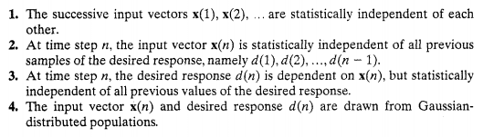
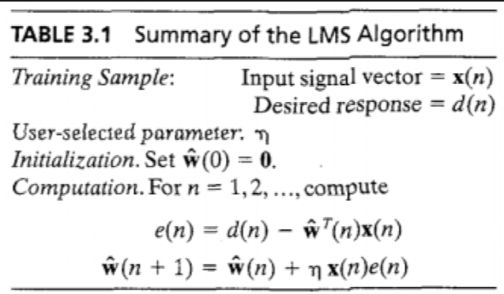

---
tags:
  - ai
  - maths
---
-   To handle overlapping classes
-   Linearity condition remains
	-   Linear boundary
-   No hard limiter
	-   Linear neuron
-   Cost function changed to error, $J$
	-   Half doesn’t matter for error
		-   Disappears when differentiating

$$\mathfrak{E}(w)=\frac{1}{2}e^2(n)$$
-   Cost' w.r.t to weights
$$\frac{\partial\mathfrak{E}(w)}{\partial w}=e(n)\frac{\partial e(n)}{\partial w}$$
- Calculate error, define delta
$$e(n)=d(n)-x^T(n)\cdot w(n)$$
$$\frac{\partial e(n)}{\partial w(n)}=-x(n)$$
$$\frac{\partial \mathfrak{E}(w)}{\partial w(n)}=-x(n)\cdot e(n)$$
- Gradient vector
	- $g=\nabla\mathfrak{E}(w)$
	- Estimate via:
$$\hat{g}(n)=-x(n)\cdot e(n)$$
$$\hat{w}(n+1)=\hat{w}(n)+\eta \cdot x(n) \cdot e(n)$$

-   Above is a [feedforward](../Architectures.md) loop around weight vector, $\hat{w}$
	-   Behaves like low-pass filter
		-   Pass low frequency components of error signal
	-   Average time constant of filtering action inversely proportional to learning-rate
		-   Small value progresses algorithm slowly
			-   Remembers more
			-   Inverse of learning rate is measure of memory of LMS algorithm
-   $\hat{w}$ because it's an estimate of the weight vector that would result from steepest descent
	-   Steepest descent follows well-defined trajectory through weight space for a given learning rate
	-   LMS traces random trajectory
	-   Stochastic gradient algorithm
	-   Requires no knowledge of environmental statistics

## Analysis

-   Convergence behaviour dependent on statistics of input vector and learning rate
	-   Another way is that for a given dataset, the learning rate is critical
-   Convergence of the mean
	- $E[\hat{w}(n)]\rightarrow w_0 \text{ as } n\rightarrow \infty$
	- Converges to Wiener solution
	- Not helpful
- Convergence in the mean square
	- $E[e^2(n)]\rightarrow \text{constant, as }n\rightarrow\infty$
- Convergence in the mean square implies convergence in the mean
	- Not necessarily converse

## Advantages
-   Simple
-   Model independent
	-   Robust
-   Optimal in accordance with $H^\infty$, minimax criterion
	-   _If you do not know what you are up against, plan for the worst and optimise_
-   ___Was___ considered an instantaneous approximation of gradient-descent

## Disadvantages
-   Slow rate of convergence
-   Sensitivity to variation in eigenstructure of input
-   Typically requires iterations of 10 x dimensionality of the input space
	-   Worse with high-d input spaces

-   Use steepest descent
-   Partial derivatives

-   Can be solved by matrix inversion
-   Stochastic
	-   Random progress
	-   Will overall improve

$$\hat{w}(n+1)=\hat{w}(n)+\eta\cdot x(n)\cdot[d(n)-x^T(n)\cdot\hat w(n)]$$
$$=[I-\eta\cdot x(n)x^T(n)]\cdot\hat{w}(n)+\eta\cdot x(n)\cdot d(n)$$

Where
$$\hat w(n)=z^{-1}[\hat w(n+1)]$$
## Independence Theory

