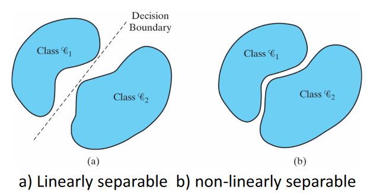

Error-Correcting Perceptron Learning

-   Uses a McCulloch-Pitt neuron
	-   One with a hard limiter
-   Unity increment
	-   Learning rate of 1

If the $n$-th member of the training set, $x(n)$, is correctly classified by the weight vector $w(n)$ computed at the $n$-th iteration of the algorithm, no correction is made to the weight vector of the perceptron in accordance with the rule:   
$$w(n + 1) = w(n) \text{ if  $w^Tx(n) > 0$  and  $x(n)$  belongs to class $\mathfrak{c}_1$}$$
$$w(n + 1) = w(n) \text{ if $w^Tx(n) \leq 0$ and $x(n)$ belongs to class $\mathfrak{c}_2$}$$
Otherwise, the weight vector of the perceptron is updated in accordance with the rule
$$w(n + 1) = w(n) - \eta(n)x(n) \text{ if } w^Tx(n) > 0 \text{ and } x(n) \text{ belongs to class }\mathfrak{c}_2$$
$$w(n + 1) = w(n) + \eta(n)x(n) \text{ if } w^Tx(n) \leq 0 \text{ and } x(n) \text{ belongs to class }\mathfrak{c}_1$$

1. _Initialisation_. Set $w(0)=0$. perform the following computations for   
time step $n = 1, 2,...$   
2. _Activation_. At time step $n$, activate the perceptron by applying continuous-valued input vector $x(n)$ and desired response $d(n)$.   
3. _Computation of Actual Response_. Compute the actual response of the perceptron:   
$$y(n) = sgn[w^T(n)x(n)]$$  
where $sgn(\cdot)$ is the signum function.   
4. _Adaptation of Weight Vector_. Update the weight vector of the perceptron:   
$$w(n+1)=w(n)+\eta[d(n)-y(n)]x(n)$$  where
$$
d(n) = \begin{cases}
+1 &\text{if $x(n)$ belongs to class $\mathfrak{c_1}$}\\
-1 &\text{if $x(n)$ belongs to class $\mathfrak{c_2}$}
\end{cases}
$$
5. _Continuation_. Increment time step $n$ by one and go back to step 2.

-   Guarantees convergence provided
	-   Patterns are linearly separable
		-   Non-overlapping classes
		-   Linear separation boundary
	-   Learning rate not too high
-   Two conflicting requirements
	1.  Averaging of past inputs to provide stable weight estimates
		-   Small eta
	2.  Fast adaptation with respect to real changes in the underlying distribution of process responsible for $x$
		-   Large eta

