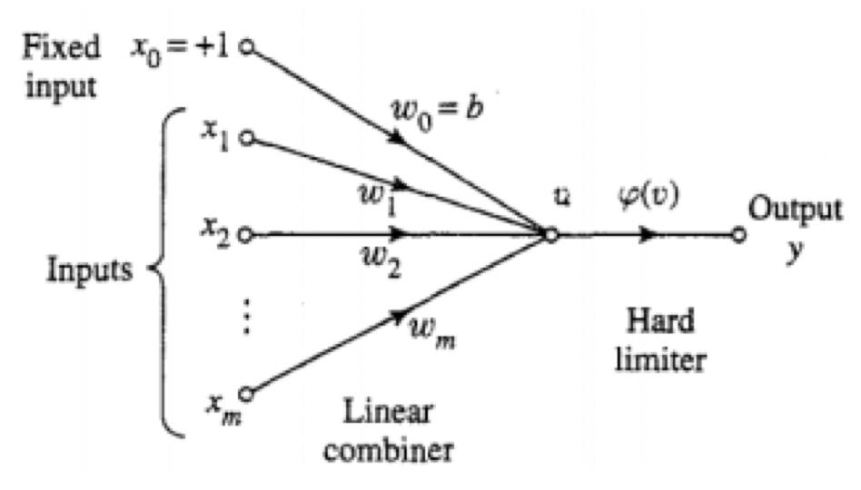
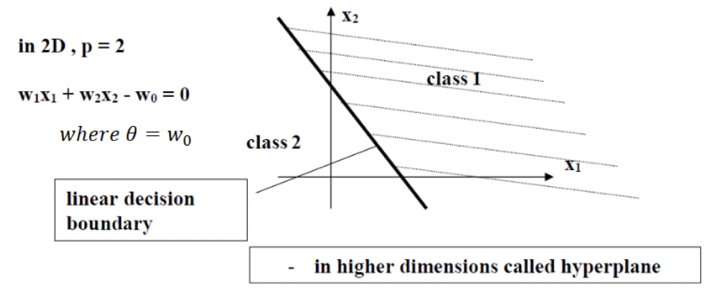

$$v(n)=\sum_{i=0}^{m}w_i(n)x_i(n)$$
$$=w^T(n)x(n)$$

Perceptron learning is performed for a finite number of iteration and then stops

[[Least Mean Square|LMS]] is continuous learning that doesn't stop