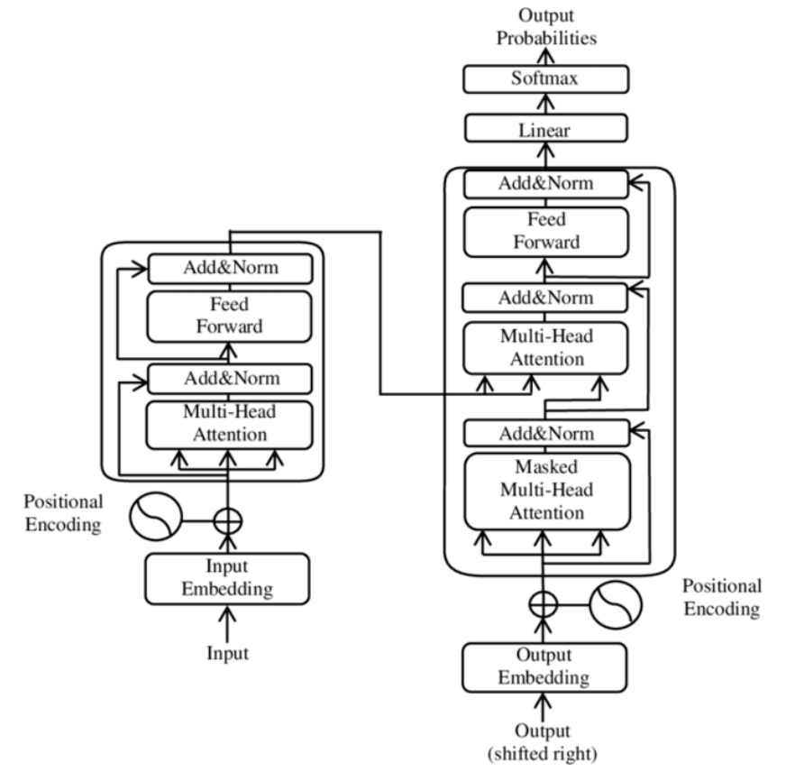

- [Self-attention](Attention.md)
	- Weighting significance of parts of the input
		- Including recursive output
- Similar to [RNN](../RNN/RNN.md)s
	- Process sequential data
	- Translation & text summarisation
	- Differences
		- Process input all at once
	- Largely replaced [LSTM](../RNN/LSTM.md) and gated recurrent units (GRU) which had attention mechanics
- No recurrent structure

## Examples
- BERT
	- Bidirectional Encoder Representations from Transformers
	- Google
- Original GPT

[transformers-explained-visually-part-1-overview-of-functionality](https://towardsdatascience.com/transformers-explained-visually-part-1-overview-of-functionality-95a6dd460452)
# Architecture
## Input
- Byte-pair encoding tokeniser
- Mapped via word embedding into vector
	- Positional information added

## Encoder/Decoder
- Similar to seq2seq models
- Create internal representation
- Encoder layers
	- Create encodings that contain information about which parts of input are relevant to each other
	- Subsequent encoder layers receive previous encoding layers output
- Decoder layers
	- Takes encodings and does opposite
	- Uses incorporated textual information to produce output
	- Has attention to draw information from output of previous decoders before drawing from encoders
- Both use [Attention](Attention.md)
- Both use [dense](../MLP/MLP.md) layers for additional processing of outputs
	- Contain residual connections & layer norm steps