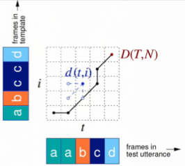
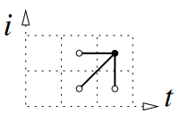
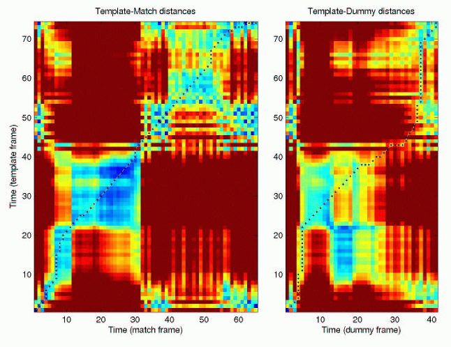
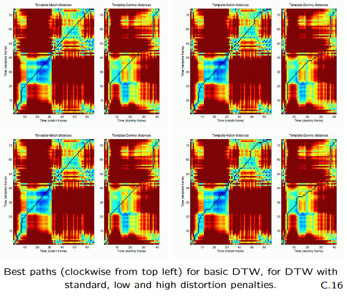
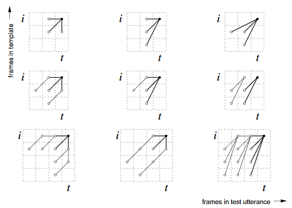
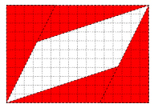
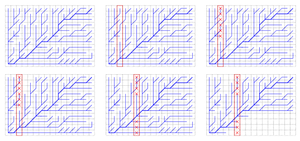

***Deterministic
Pattern Recogniser***
Allows timescale variations in sequences for same class

$$D(T,N)=\min_{t,i}\sum_{\substack{t\in1..T \\ i\in1..N}}d(t,i)$$
- $d(t,i)$ is distance between features from $t$-th frame of test to $i$-th frame of template

$$D(t,i)=\min[D(t,i-1),D(t-1, i-1),D(t-1,i)]+d(t,i)$$
- Allowing transition from current and previous frame only
- Recursive

# Problems
- How much flexibility to allow?
- How to penalise warping?
- How to determine a fair distance metric?
- How many templates to register?
	- How to select best ones?

# Basic Algorithm
1. Initialise the cumulative distances for $t=1$
$$D(1,i)=\begin{cases}d(1,i) & \text{for }i=1, \\ D(1, i-1)+d(1,i) & \text{for }i=2,...,N\end{cases}$$
2. Recur for $t=2,...,T$
$$D(t,i)=\begin{cases}D(t-1,i) + d(t,i) & \text{for }i=1, \\ \min[D(t, i-1), D(t-1, i-1),D(t-1,i)] + d(t,i) & \text{for }i=2,...,N\end{cases}$$
3. Finalise, the cumulative distance up to the final point gives the total cost of the match: $D(T,N)$

- Euclidean distances

# Distortion Penalty
1. Initialise the cumulative distances for $t=1$
$$D(1,i)=\begin{cases}d(1,i) & \text{for }i=1, \\ d(1,i)+D(1, i-1)+d_V & \text{for }i=2,...,N\end{cases}$$
2. Recur for $t=2,...,T$
$$D(t,i)=\begin{cases}d(t,i)+D(t-1,i1)+d_H & \text{for }i=1, \\ \min[d(t,i)+D(t,i-1)+d_V,2d(t,i)+D(t-1,i-1),d(t,i)+D(t-1,i)+d_H] & \text{for }i=2,...,N\end{cases}$$
- Where $d_V$ and $d_H$ are costs associated with vertical and horizontal transitions respectively
3. Finalise, the cumulative distance up to the final point gives the total cost of the match: $D(T,N)$

- Allows weighting for dynamic penalties when moving horizontally or vertically
	- As opposed to diagonally

# Store Best Path
1. Initialise distances and traceback indicator for $t=1$
$$D(1,i)=\begin{cases}d(1,i) & \text{for } i=1,\\ d(1,i)+D(1,i-1) & \text{for }i = 2,...,N\end{cases}$$
$$\phi(1,i)=\begin{cases}[0,0] & \text{for } i=1,\\ [1,i-1] & \text{for }i = 2,...,N\end{cases}$$
2. Recur for cumulative distances at $t=2,...,T$
$$D(1,i)=\begin{cases}d(t,i)+D(t-1,i) & \text{for } i=1,\\ d(t,i)+\min[D(t,i-1),D(t-1,i-1),D(t-1,i)] & \text{for }i = 2,...,N\end{cases}$$
$$\phi(1,i)=\begin{cases}[t-1,i] & \text{for } i=1,\\ \arg\min[D(t,i-1),D(t-1,i-1),D(t-1,i)] & \text{for }i = 2,...,N\end{cases}$$
3. Final point gives the total alignment cost D(T,N) and the end coordinates of the best path $z_K=[T,N]$, where $K$ is the number of nodes on the optimal path
4. Trace the path back for $k=K-1,...,1,z_k=\phi(z_{k+1}), \text{ and }Z=\{z_1,...,z_K\}$
- Stores best path

- Vary allowable movements through grid
- Second row for blocking multiple of the same movements in succession

# Search Pruning
- Speed up algorithm for real-time
- Kill bad options

## Gross Partitioning

- Too far from diagonal
- Probably wrong or bad

## Score Pruning

- Examine existing branches
- See which scores are really bad