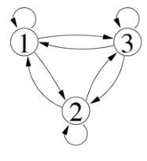
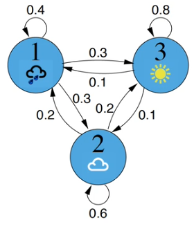
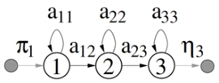
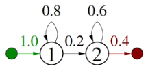
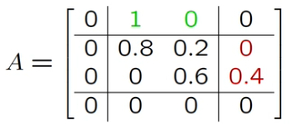
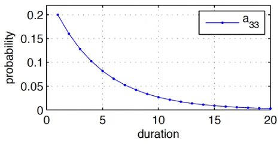

---
tags:
  - ai
---
[Hidden Markov Models - JWMI Github](https://jwmi.github.io/ASM/5-HMMs.pdf)
[Rabiner - A Tutorial on Hidden Markov Models and Selected Applications in Speech Recognition](https://www.cs.cmu.edu/~cga/behavior/rabiner1.pdf)

- Stochastic sequences of discrete states
	- Transitions have probabilities
- Desired output not always produced the same
	- Same pronunciation

$$P(X|M)=\left(\prod_{t=1}^Ta_{x_{t-1}x_t}\right)\eta_{x_T}$$
$$a_{x_0x_1}=\pi_{x_1}$$

# 1st Order
- Depends only on previous state
	- Markov assumption

$$P(x_t=j|x_{t-1}=i,x_{t-2}=h,...)\approx P(x_t=j|x_{t-1}=i)$$

- Described by state-transition probabilities

$$a_{ij}=P(x_t=j|x_{t-1}=i), 1\leq i,j\leq N$$

- $\alpha$
	- State transition
- For $N$ states
	- $N$  by $N$ matrix of state transition probabilities

# Weather

$$A=\left\{a_{ij}\right\}=\begin{bmatrix} 0.4 & 0.3 & 0.3\\ 0.2 & 0.6 & 0.2 \\ 0.1 & 0.1 & 0.8 \end{bmatrix}$$
rain, cloud, sun across columns and down rows
$$A=\{\pi_j,a_{ij},\eta_i\}=\{P(x_t=j|x_{t-1}=i)\}$$

# Start/End
- Null states
	- Entry/exit states
	- Don't generate observations

$$\pi_j=P(x_1=j) \space 1 \leq j \leq N$$
- Sub $j$ because probability of kicking off into that state
$$\eta_i=P(x_T=i) \space 1 \leq i \leq N$$
- Sub $i$ because probability of finishing from that state

# State Duration
- Probability of staying in state decays exponentially
$$p(X|x_1=i,M)=(a_{ii})^{\tau-1}(1-a_{ii})$$

- Given, $a_{33}=0.8$
- $\times0.8$ repeatedly
	- Stay in state