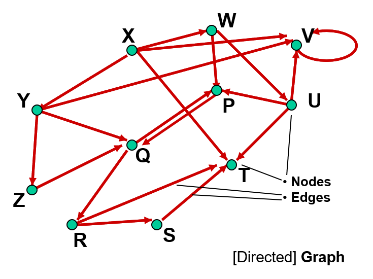
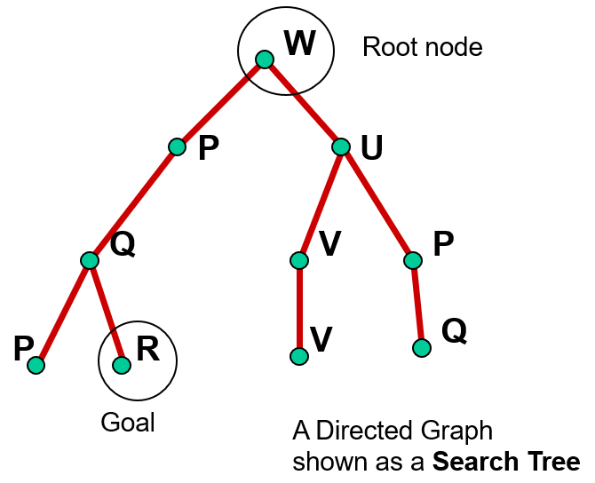

# [Uninformed](Uninformed.md)
- Breadth First
- Uniform Cost
- Depth First
- Depth Limited
- Iterative Deepening
- Bi-directional

## Characteristics
- Goal-led
- No information on # steps
- General purpose
	- Weak
	- Optimal
	- Exact

# [Informed](Informed.md)
- Best First
- Greedy
- Route Planning
- A*

## Characteristics
- Knowledge used to limit # possibilities
- Intelligent heuristic methods
- May give sub-optimal / wrong results

# Exhaustive
- All possibilities

# Evaluation
- Completeness
	- Guaranteed to find a solution?
- Time Complexity
	- How long?
- Space Complexity
	- How much memory?
- Optimality
	- Is solution the best solution?

# Queuing
- Search strategy dictates which nodes on frontier to expand in which order
- Easiest to implement as a queue
- Breadth first
	- New nodes to back of queue
- Depth first
	- New nodes added to front of queue
		- Likely need to use recursion
- Uniform cost
	- Nodes added to queue in order of lowest cost first

# Abstraction
- Remove superfluous information
- Represent problem in ***state space***
	- States reachable from initial state by actions is ***path***

