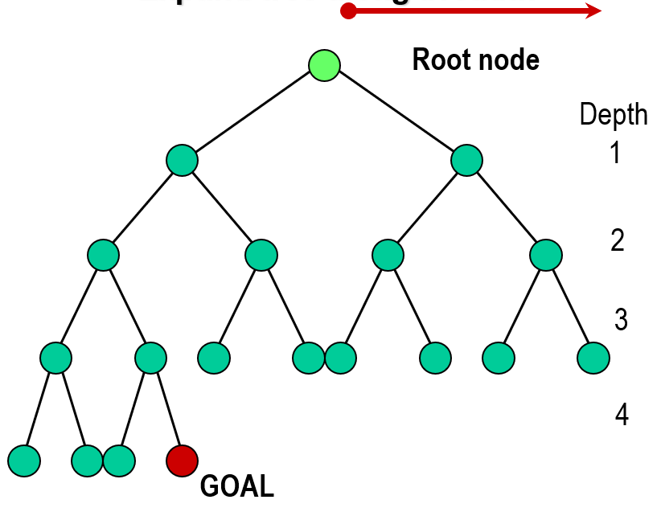
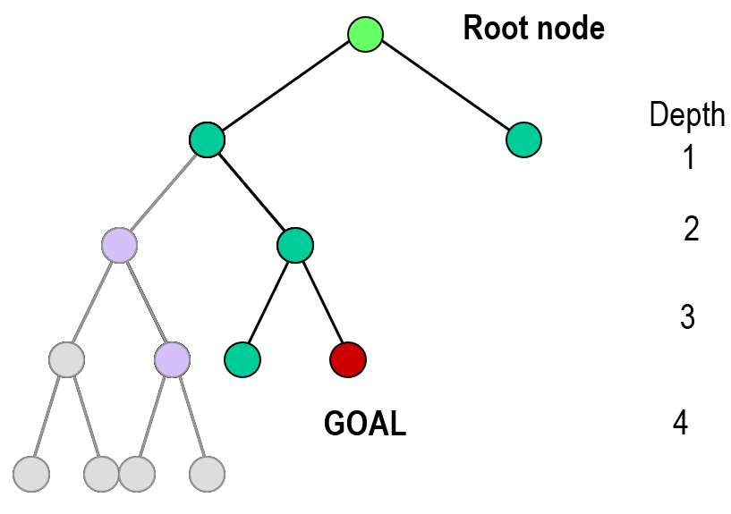
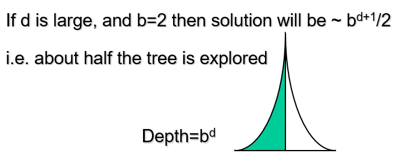
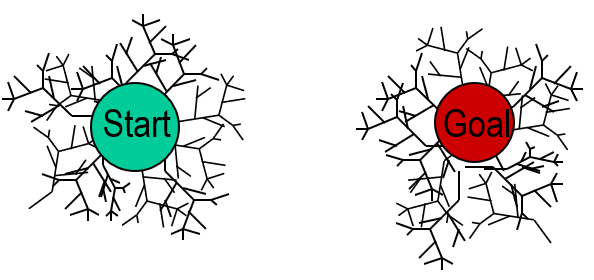
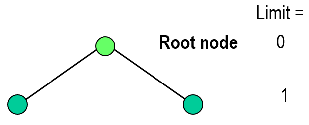
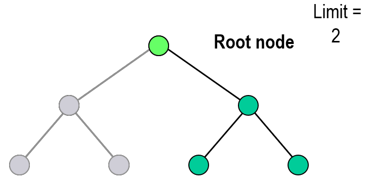
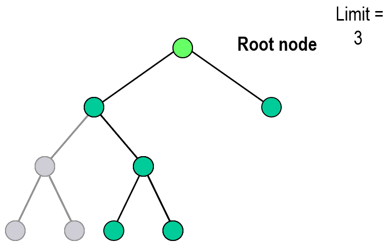
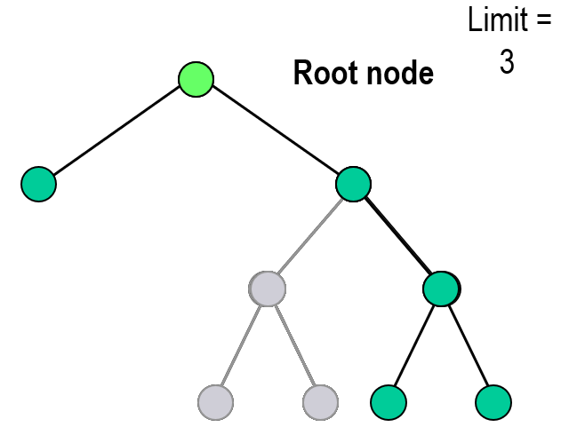
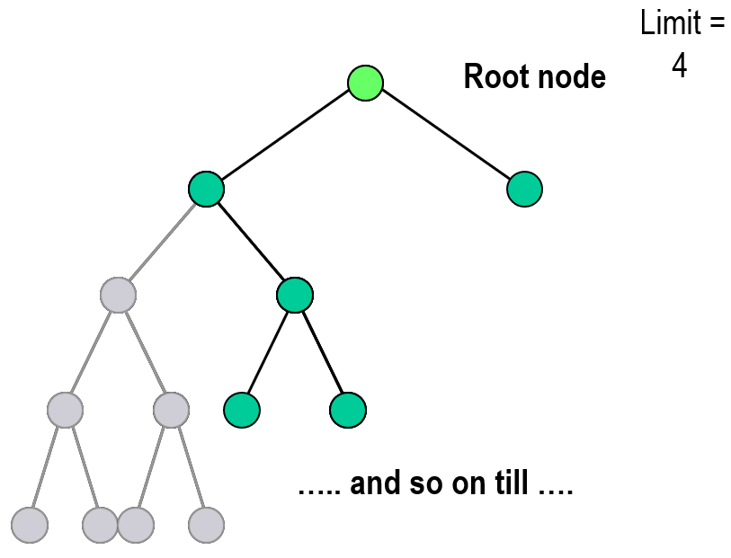
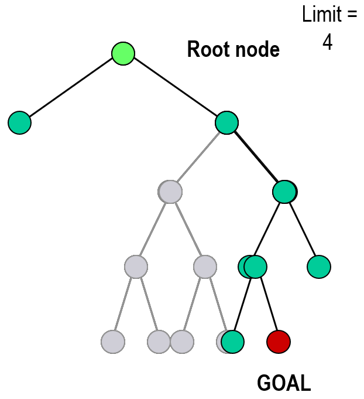

# Breadth First
- Uniform cost with cost function proportional to depth
- All of each layer
- Max nodes before solution
	- $=1+b+b^2+b^3+b^4+...+b^n$
- Time, space complexity = $O(b)^d$
	- Exponential
	- Lots of time but complete and optimal
- Goal at depth, $d1$
	- $1+b+b^2+b^3+b^4+...+b^{d-1}=\frac{b^d-1}{b-1}$
- Average at $\frac{1+b^d}{2}$ terminal nodes

# Depth First
- Between $(1+d)$ and $(\frac{b^{d+1}-1}{b-1})$  
	- If at left hand side or right hand side
- Much less memory space than BFS
	- Non-optimal, non-complete

## Depth Limited
- Predetermined max depth
- Only complete if max depth is sufficiently large
	- Hard to determine

# Bi-Directional
- Out from start and goal until they meet
- If done with heuristics
	- May not crossover

# Iterative Deepening
- Combine BFS and DFS

