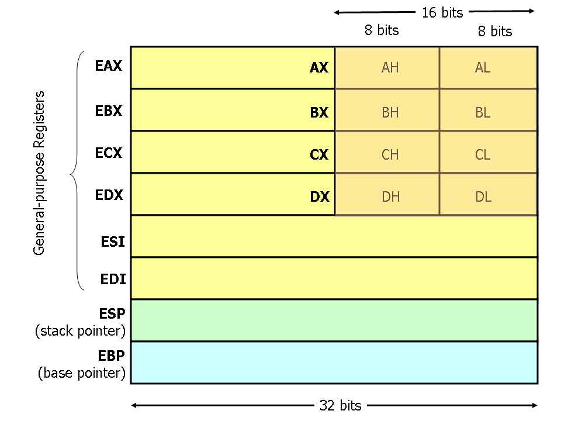
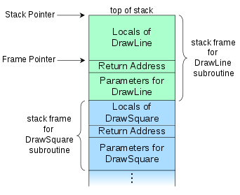

---
tags:
  - low-level
  - dev
title: Assembly
---
[Uni of Virginia - x86 Assembly Guide](https://www.cs.virginia.edu/~evans/cs216/guides/x86.html)

## x86 32-bit

## Stack
- push, pop, call, ret

- Growing upwards

# Assembler
- [NASM](https://nasm.us/doc/nasmdoc0.html)
