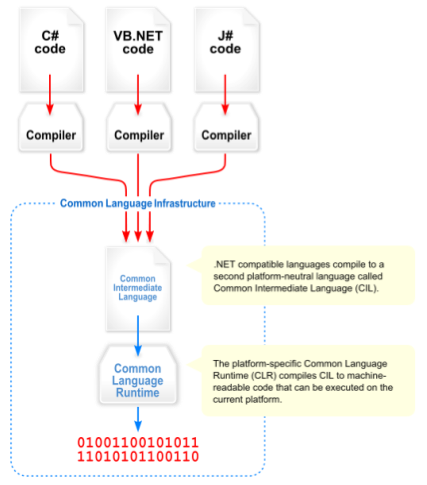

# Common Language Infrastructure
## CLI
-   Language-neutral platform

# Common Language Runtime
## CLR
-   Virtual Execution System
	-   VES
	-   Defined by CLI
-   JIT managed code into machine instructions
-   Execution engine
	-   VM
	- [Language Binding](../Language%20Binding.md#Virtual%20Machines)
-   Services
	-   Memory management
	-   Type safety
	-   Exception handling
	-   Garbage collection
	-   Security
	-   Thread management

# Common Intermediate Language
## CIL
-   Intermediate language for CLI
-   Run by CLR
-   Object-oriented, stack-based bytecode

# Assemblies
-   Compiled CLI code
-   Portable executable (PE)
	-   DLL, EXE

## Resources
[Make microservices fun again with Dapr](https://www.daveabrock.com/2021/04/29/meet-dapr/)
[Dapr for .NET](https://docs.microsoft.com/en-gb/dotnet/architecture/dapr-for-net-developers/)