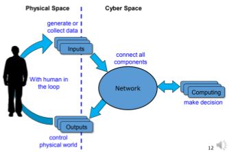
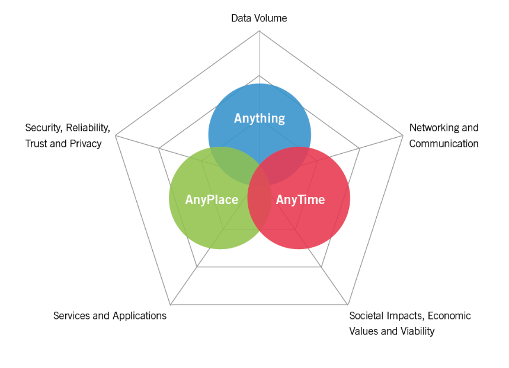
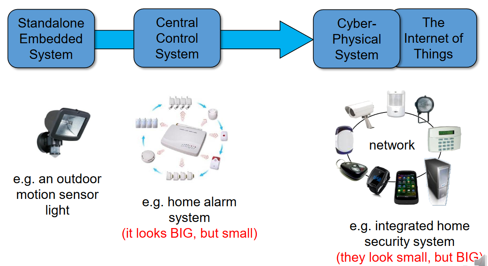

---
tags:
  - iot
---
- Highly pervasive
- High automated
- More decentralised

- Collaborating computational elements to control physical entities
	- Integrates
		- Computation
		- Networking
		- Physical processes

# Cyber-Physical Social Data

- Middle indicates a network but
	- Small
	- Proprietary
	- Closed
	- Cannot be extended that far