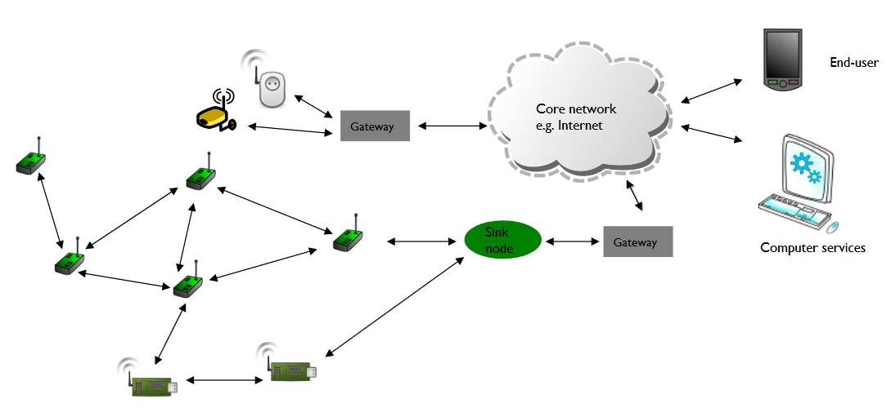

   

# Gateway
- Connects IoT devices to internet
- Operator deployed
	- LTE etc
- Self-deployed
	- Wi-Fi
## Roles
- Machine-to-machine connections
	- Cheaper telecoms cost
	- Cheaper hardware
		- Not everything has to be LTE connected
	- Simpler config
- Translate protocols between IoT and internet
- Processing data
	- Encrypting, filtering, consolidating
- Boundary between networks
	- Security

# Network Module
- 802.15.4 only a channel
	- End-to-end provided by network module
- Multi-hop wireless network
	- Wireless sensor networks (WSN)
	- Wireless mobile ad hoc networks (MANET)
	- Wireless mesh network (WMN)
	- Vehicular ad hoc network (VANET)
## Roles
- Management
	- Packet
		- Adapting size and format
	- Address
		- Adapting and/or resolving addresses
	- Device
		- Joining/leaving of nodes
	- Service
		- Add-ons such as security
- Operational
	- Route discovery & maintenance
	- Packet forwarding

# Performance
- Power consumption
	- Limited supply
	- Significant power in communications
- Network Lifetime
	- Duration of proper operation
	- Before no longer provides services
		- When a node fails
	- Design-time
		- Design deployment that will last
	- Run-time
		- Dynamic operation to conserve energy usage
		- All layers
			- App
				- Consolidating data
				- Adaptive frequency for data grouping
			- Network
				- Avoid aggressive topology maintenance
			- MAC
				- Duty-cycle MAC to keep radio asleep
			- Physical
				- Power level control
## Issues
- Bottleneck
	- One node relaying lots of data
	- Bad placement of gateway

- Low power devices
- Multi-hop