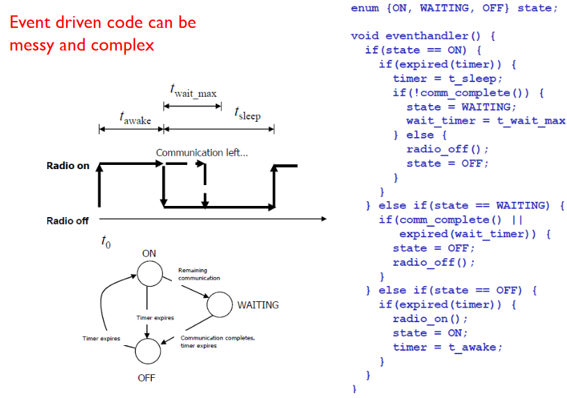
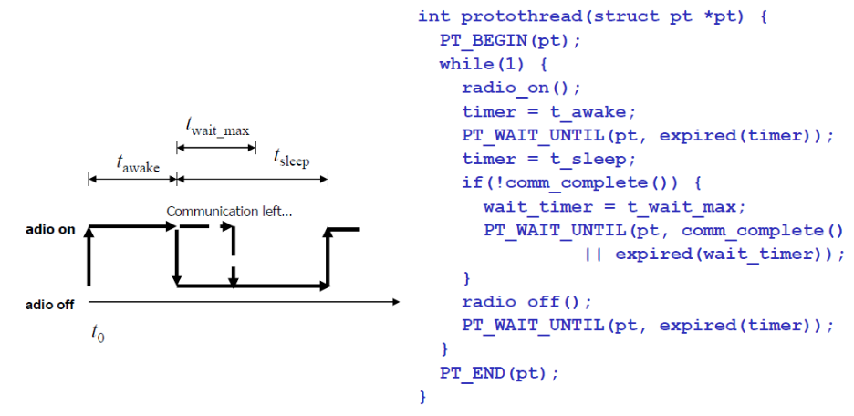

---
tags:
  - dev
---
# Threading
*Smallest sequence of programmed instructions that can be managed independently by a [scheduler](https://en.wikipedia.org/wiki/Scheduling_(computing))*
From <[https://en.wikipedia.org/wiki/Thread_(computing)](https://en.wikipedia.org/wiki/Thread_(computing))>

- Instructions run independently by scheduler
- Single address space
- One thread blocked for I/O
	- Tasks run in other threads
- Need locks and mutexes
	- Coordination between threads
- Complicated
	- Deadlocks

# Protothreads
- Lightweight
- Stack-less
- Interruptible tasks for event-based
- Conditional blocking statement
	- Blocks until given statement is true
- Use timer to manage
- Invoked whenever process receives message from another process or timer

# Events
*Action or occurrence recognized by software, often originating asynchronously from the external environment, that may be [handled](https://en.wikipedia.org/wiki/Event_handler) by the software*
From <[https://en.wikipedia.org/wiki/Event_(computing)](https://en.wikipedia.org/wiki/Event_(computing))>

- Event loop
	- Waits for events
		- Inputs
- On event
	- Collects info
		- Dispatches to call-back
- Register handlers with OS scheduler
- Kernel usually runs loop to poll for events
- Blocking operation
	- Register call-back
		- Return control to scheduler

# Radio Sleep
- Energy efficiency
- Congestion

## Event-based

## Thread-based

- Less complex
- Faster
	- Pointer-based