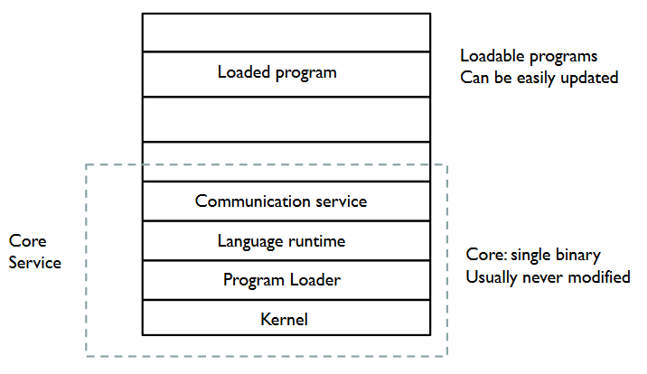

---
tags:
  - infra/linux
  - iot
---
- Linux-based
- Small memory (~20 kB)
- Wide network stacks #net 
	- TCP/IP
		- IPv6
	- 6LoWPAN
		- IPv6-based
		- Header compression
	- CoAP
		- Application layer protocol
	- RPL
		- Routing for low power
		- Lossy networks
	- SSL/TLS
	- RIME
		- Own communication solution
- Instant Contiki
	- Dev environment
	- Whole VM

# Functional
- Separates basic system from dynamically loadable and programmable services
	- Processes
- Event-driven kernel
	- Multi-threading supported by library
	- Hybrid OS
	- No hardware abstractions
- Services communicate by posting kernel events
- Refer to stack with pointer to process state
	- Each service has state in private memory space

# Process
- Cooperative
	- Code running sequentially with respect to other coop code
- Pre-emptive
	- Temporarily stops cooperative code
- Normal processes run cooperatively
	- Interrupts and real-time timers run pre-emptively
		- Higher priority
- Programs are processes
	- Started on boot
	- When module containing process loaded
- Processes run on timer firing or external events

# Timers
- Libraries
	- Used by applications and system
- Check for timer completion
- Waking system from low power
- Real-time task scheduling
- Allows cooperation when threads sleep
	- Low power mode
- timer and stimer
	- Simplest
	- See if time period passed
	- Need querying
- etimer
	- Event timers
	- Scheduling
	- Uses clock time from clock module
	- struct etimer
## Clock
- System time starts from zero when the Contiki system starts
- clock_time()
	- In ticks
- clock_seconds()
	- In seconds
- CLOCK_SECOND
	- Ticks per second

# Power Saving Mode
- Kernel does not provide any power saving abstractions
- Need to implement in application
- To help an application decide when to power down the system
	- The event scheduler exposes the size of event queue
	- If there were not events scheduled, this information can be used to power down the processor