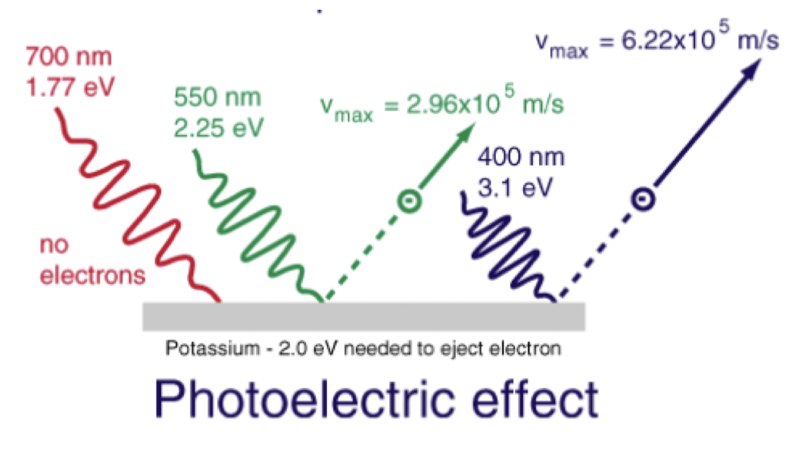
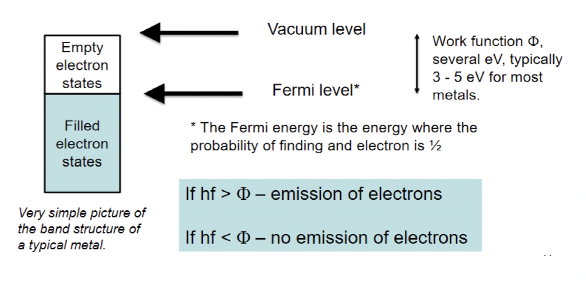
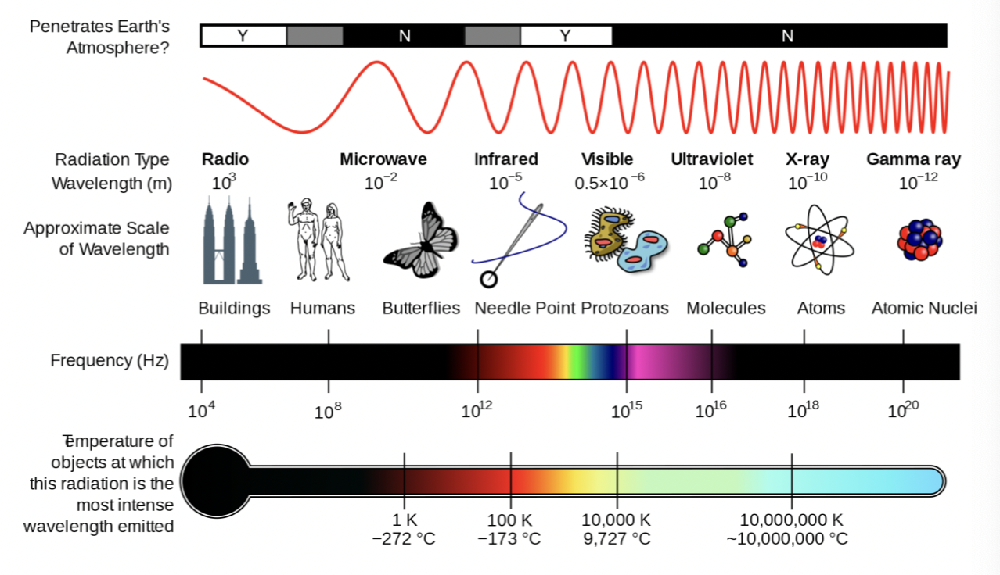

$$E=hf$$
## Photoelectric Effect

- Emission of charged particles when exposed to UV light
- Electrons
- Einstein suggested light is quantised

1. The maximum KE of ejected electrons is independent of intensity, but dependent on frequency $n$
2. There is a minimum frequency n0below which there is no emission
3. No time delay (less than 1 ns) before the onset of emission –but the rate of electrons depends on the intensity.

-   Radio spectrum
	-   30Hz – 300 GHz