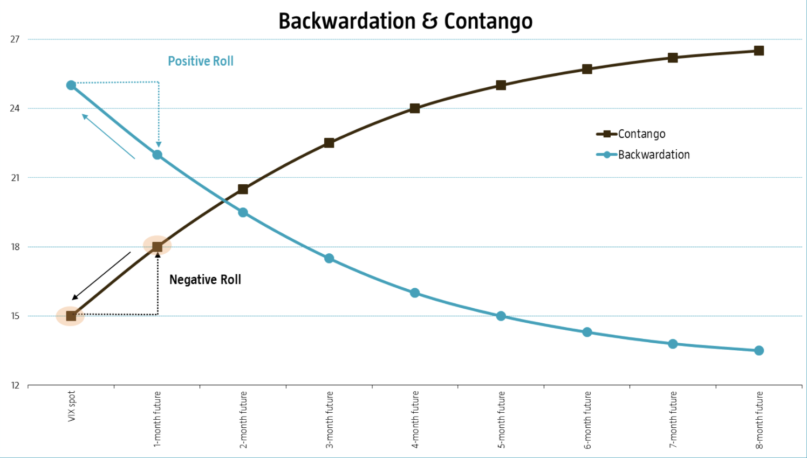

---
tags:
  - econ
---
- Bid
	- Purchase
- Offer
	- Sell

# Spot Price
- Most common in relation to commodity futures
	- [Stocks](Assets/Stocks.md) always trade at spot
- Futures prices derived from spot price

# Outright
Naked Futures

- NOT HEDGED

An outright futures position is an unhedged futures trade that is taken on its own and is not part of a larger or more complex trade.

- An outright futures position is a single directional bet position on a futures contract and is not part of a larger or more complex strategy.
- An outright position exposes the trader to greater risk than a hedged position, although the outright position has theoretically greater profit potential.
- If a hedge or offsetting position is added to an outright position, then it is no longer an outright position, but rather a hedged or partially-hedged position

From <[https://www.investopedia.com/terms/o/outrightfuturesposition.asp](https://www.investopedia.com/terms/o/outrightfuturesposition.asp)>