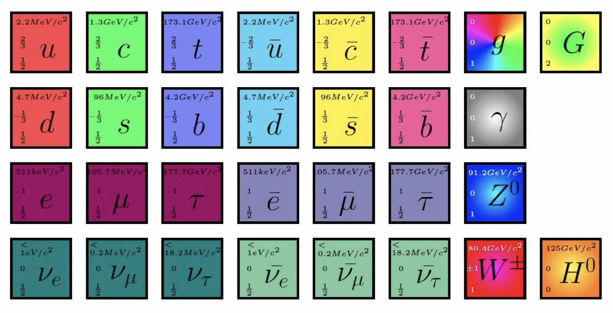
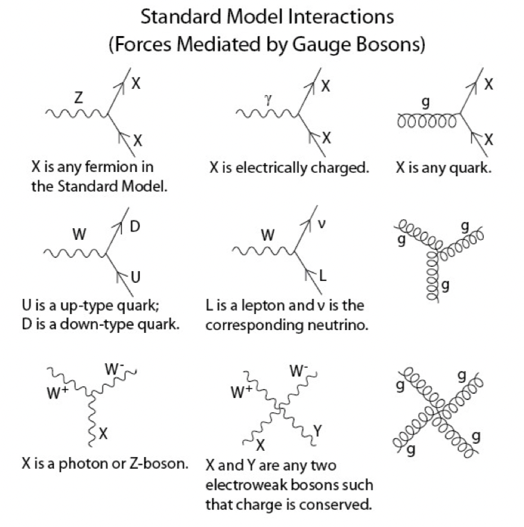
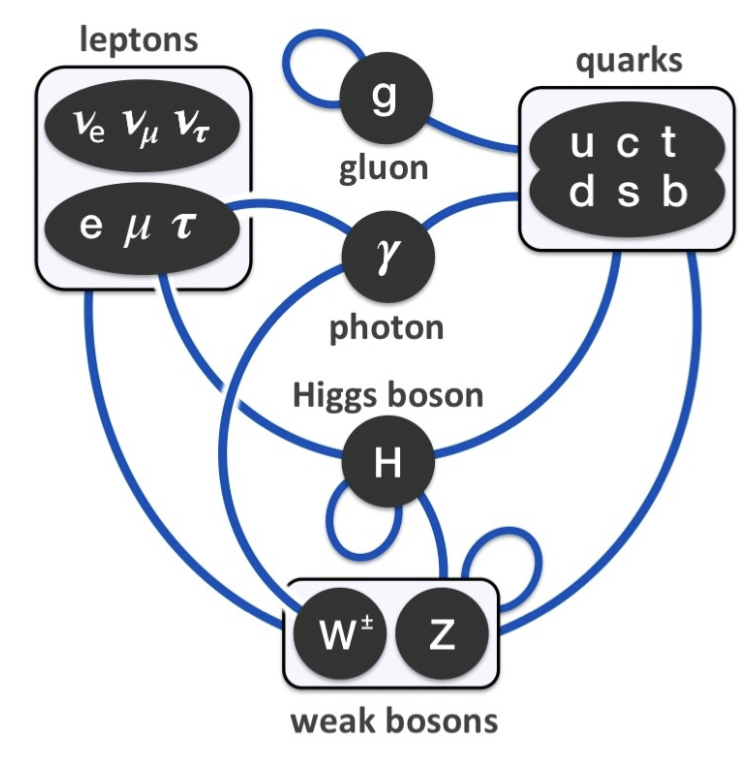

---
tags:
  - quantum
---

- 4 fundamental forces
	- Bosons
- Elementary particles

- Fermions
	- Spin 1/2
	- Fermi-Dirac statistics
	- 3 generations of similar pairs
	- Quarks
		- Colour charge
		- Strong interactions
	- Leptons
		- No colour
		- Electroweak interactions
- Bosons
	-  Scalar
		- Spin 0
		- Higgs
	- Gauge
		- Spin 1
		- Force carriers
		- y, W, Z, g

