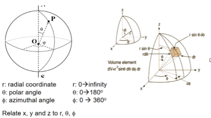
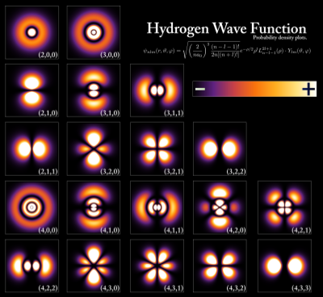
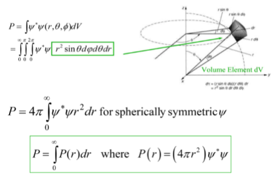
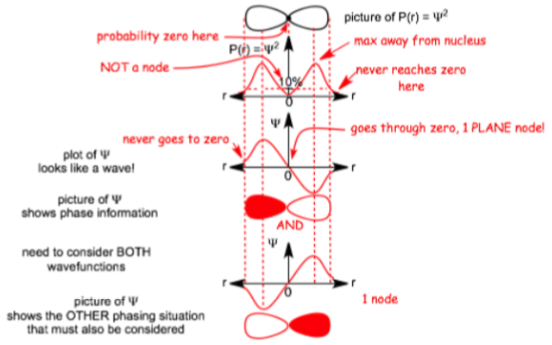
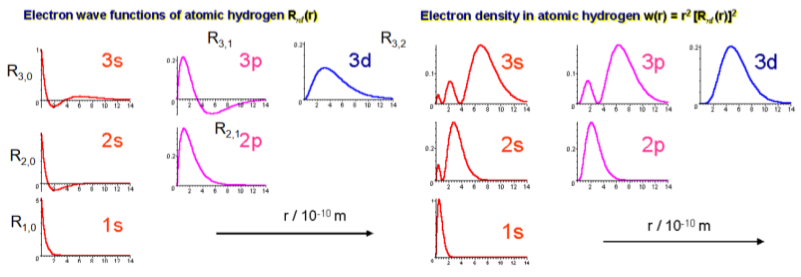
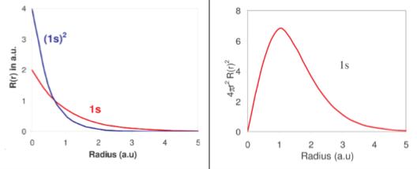

---
tags:
  - quantum
---
$$\psi(r,\theta,\phi)=R(r)\cdot Y_{ml}(\theta, \phi)$$
Wave functions are products of
Radial Function
- $R_{n,l}(r)$
Spherical Harmonic
- $Y_{ml}(\theta, \phi)$

Forms [Orbitals](Orbitals.md)

Absolute value of wave function squared gives probability density of finding electron inside differential volume $dV$ centred on $r, \theta, \phi$

$$|\psi(r,\theta,\phi)|^2$$

